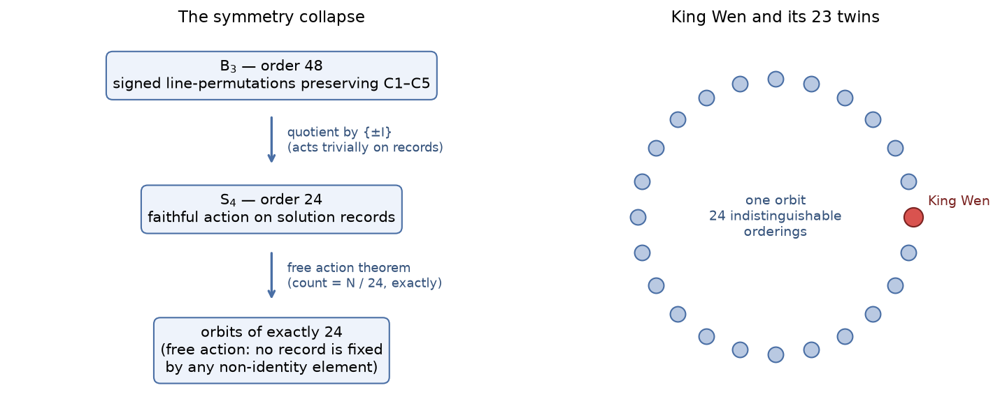

# TR-5 — Symmetry: The Automorphism Group, Free Action, and the Twins Demonstration
*Technical report — not peer-reviewed. Every MEASURED result carries a reproduction command, and every
proof cited as machine-checked names its certificate or Lean theorem; claims of scope, attribution and
interpretation are argued, not verified.*

Methods, environment pinning, statistics conventions, and artifact access: see [METHODS.md](METHODS.md).

## Executive summary

Some transformations — relabeling every hexagram by the same line-permutation, flipping all of them —
turn one valid ordering into another. This report works out the complete set of such symmetries (a group
of 48) and proves the striking consequence: **every valid ordering, King Wen included, has exactly 23
mathematically indistinguishable "twins"** that the rules cannot tell apart. None of King Wen's twins
appear in the 10.5-billion-record enumeration — direct evidence that the enumerated slice, however
large, is a biased window on the full space. The report also corrects a previously published negative
result of ours (an earlier search had missed the symmetry), and keeps that correction prominent: the
mistake and its fix are part of the record.

## Abstract
The C1–C5 constraint system admits an exact symmetry group: the **48 bit-position permutations commuting
with bit-reversal** (the centralizer of `rev` in S₆, isomorphic to **B₃ ≅ Z₂ ≀ S₃**, the octahedral group)
— proven, not sampled, and (v2.0) **complete over ALL 64! hexagram relabelings**: no permutation of the
hexagram set outside these 48 preserves the C1–C5 predicate family, with C1+C2+C4 alone forcing
membership (previously the classification stopped at the hyperoctahedral group Aut(Q₆), order 46,080). At the
canonical-record level the effective group is **B₃/{±I} ≅ S₄ (order 24)**, the action is **free** (proven
2026-07-03), so every valid ordering — not just King Wen — has exactly 23 record-level "twins" and the
**record-level** orbit count is exactly N/24 (at the orientation-explicit *sequence* level the divisor is
48 — level precision stated in §4). The result *overturns a previously published negative*: an earlier version of
the project's own symmetry document (2026-04-25, "reaffirmed" 2026-06-11) concluded the constraint set was
rigid; its data was correct but measured budget/dedup artifacts, not solution-set asymmetry. Direct
bisection of the 560T canonical then delivered the concrete demonstration: King Wen is present, **all 23
of its twins are absent** — proving membership set-theoretically while showing budgeted presence reflects
the search's frame of reference. The methodological lesson is the report's spine: budgeted-slice
statistics cannot decide set-level properties.

*Novelty status: we are not aware of a prior statement of this symmetry group for the King Wen constraint
system; prior-art corrections are welcomed via CITATIONS.md. This scoping is informed, not ignorant, of
the hexagram-level algebraic prior art, which is **distinct**: [Ouyang Weicheng
1992](../documentation/CITATIONS.md#ouyang1992) proved the (Z/2)⁶ group structure on the 64 hexagrams
(with subgroup/coset machinery), and [Zhang Qingyu 1998](../documentation/CITATIONS.md#zhang1994)
published the complement/reversal (Klein-4) orbit on the hexagram set — both are groups acting on
**hexagrams**; this report's group is the automorphism group of the C1–C5 **constraint-predicate
family** acting on bit positions, inducing an action on whole orderings — a different group on a
different object (see CITATIONS.md §"(Z/2)⁶ framing — priority ceded"). (Related but distinct formal work: [Radisic
2026](../documentation/CITATIONS.md#radisic2026), arXiv:2601.07175, formalizes King Wen pairing optimality in Lean 4 + Mathlib — a different object.)*

## Sections
1. **Theorem and proof.** For every σ in G = C_{S₆}(rev), acting linearly on GF(2)⁶: S satisfies C1–C5 ⟺
   σ(S) does. Proof by constraint: σ is a Hamming isometry (C2, C5 — difference-wave multiset unchanged);
   coordinate permutations fix 0 and 63 (C4); linearity with σ(63) = 63 gives σ(h ⊕ 63) = σ(h) ⊕ 63, so
   complement pairs map to complement pairs at unchanged positions (C3); σ∘rev = rev∘σ gives
   σ(partner(h)) = partner(σ(h)) (C1). Maximality: any Aut(Q₆) element with a nontrivial flip moves 0 or 63
   (violates C4); each of the 672 bit permutations outside G maps King Wen to a C1-violating sequence
   (exhaustively verified 2026-07-02). Structure: rev = (0 5)(1 4)(2 3); its centralizer is Z₂ ≀ S₃ ≅ B₃,
   order 48, element orders {1:1, 2:19, 3:8, 4:12, 6:8}; rev is the central −I and fixes every
   pair-sequence, giving the record-level group S₄ (order 24).
   **Completeness (v2.0, 2026-07-18): the classification extends from Aut(Q₆) to all of Sym(H).**
   Any σ among the 64! hexagram relabelings preserving C1, C2 and C4 (as predicates over all
   sequences) lies in G. Funnel: C4 forces σ(63)=63, σ(0)=0; C2 forces σ into the automorphism
   group of the distance-5 graph G₅ (via a 1,824-sequence witness family), which is isomorphic to
   Q₆ by the parity-complement map ψ and has order exactly 46,080 (two-common-neighbor rigidity);
   fixing 0 kills the translation part and ψ-conjugation collapses to the 720 bit-position
   permutations; commuting with partner (C1) cuts those to exactly the 48 of C_{S₆}(rev). Every
   finite step is verified exhaustively by `solve.py --symmetry-completeness` (gates SC-1…SC-8);
   the rigidity kernel is additionally emitted as a self-validated CNF (`sat.py --rigidity-cnf`)
   and **decided UNSAT with an archived, drat-trim-verified certificate**
   ([certificates/rigidity_sc4_unsat.drat.gz](certificates/rigidity_sc4_unsat.drat.gz), 4,096 vars /
   282,760 clauses, `s VERIFIED`, covered by `verify_all.sh`) — so no verification leg of this funnel
   remains unproduced. Scope: per-predicate
   preservation; the solution-set automorphism group is bounded below by G and not decided above.
   Full proof: [SYMMETRY_SEARCH.md §Completeness](../documentation/SYMMETRY_SEARCH.md).
2. **A published negative, overturned — kept in its honest framing.** The original document concluded "All
   47 falsified… the constraint set is rigid against bit-position permutations. No factor-of-2-to-48
   enumeration cost reduction is available." That conclusion was **wrong**, and the correction (2026-07-02)
   supersedes it while preserving the original data, which was and remains correct as *budgeted-yield*
   data: per-cell yields from the budget-truncated 100T log differ hugely between σ-related cells (max
   >1.5M records; ≥21,000 mismatched cell pairs per σ). Two mechanisms, neither about the solution set:
   (a) *frontier ordering* — σ permutes hexagram values hence DFS child order, so a fixed per-cell budget
   explores a different region of the isomorphic tree (equal totals, different budgeted slices); (b)
   *dedup convention* — the lex-smallest-orientation representative is not σ-equivariant, so records
   migrate between orbit-mate cells. Diagnostic confirmation: the old test's closest "near-miss" was
   σ = [5,4,3,2,1,0] (bit reversal, 43% match) — precisely the central element acting trivially on
   pair-sequences, leaving only the artifacts. The lesson is recorded in [CRITIQUE.md](../documentation/CRITIQUE.md).
3. **Empirical corroboration at three independent levels.** (i) Exhaustive σ(KW) test over all 720 bit
   permutations: exactly the 48 σ ∈ G yield valid C1–C5 sequences (the other 672 fail C1); the 48 raw
   sequences are distinct and collapse to 24 distinct canonical pair-orderings (KW + 23 twins), each with
   complement-distance sum C3 = 776 exactly. (ii) Exact tree isomorphism: for a KW-following 23-pair prefix (counting C4's pinned opening pair; TR-4 and SEARCH_SPACE_SIZE call the same object a "22-pair prefix", counting only the 22 *free* pairs after it — convention stated 2026-08-01, the object is identical: tree_nodes 9,422,793 / 16,504 canonical leaves)
   and three random σ ∈ G, exact deterministic subtree counts are identical to the integer — tree_nodes =
   9,422,793 and canonical leaves = 16,504 for all four σ-related prefixes. (iii) All-cells orbit test: the
   65,281 productive 560T cells partition into 4,183 G-orbits; within-orbit CV of per-cell Knuth size
   estimates (10⁵ probes/cell) is 0.112 (median) — indistinguishable from the estimator's noise floor
   (median relerr 0.130) and 6× below the population CV (0.72). The finite component (48-of-720,
   24 record-twins) is additionally machine-checked in Lean 4 (`sigma_kw_valid_48`,
   `valid_iff_centralizes_rev`, `twins_24_records`; lean/KingWen.lean — **kernel-only** (proved by
   kernel `decide`/`decide +kernel`; `#print axioms` reports only `[propext]` / `[propext, Quot.sound]`,
   no `native_decide`, verified on a clean 2026-07-31 build). The sequence-level symmetry layer,
   Automorphism.lean, is likewise **kernel-only** — including `applyPerm_pcomp` (the group-action
   composition law) and the four `twenty_four_dvd_*` divisibility theorems behind the DIV-24 gate.
   The one obligation whose *direct* kernel `decide` is memory-infeasible (the 48·48·64
   `applyPerm_pcomp_bool`, OOMs >29 GB) is proved **structurally** rather than by enumeration over
   permutation pairs (§3a of Automorphism.lean): the composition law reduces to a single 48·64·6
   bit-relocation check (`applyPerm_bit`, kernel `decide`, ~2.8 GB) plus list/permutation reasoning,
   so `#print axioms` reports `[propext, Classical.choice, Quot.sound]` — no `native_decide`
   anywhere in the file (verified on the same 2026-07-31 build).
   **Scope of the Lean coverage (F-51):** the machine-checked component is the *finite kernel* — the
   48-of-720 classification, the record-twin count, and the supporting finite lemmas. The lift from those
   finite facts to the statement over all 64! relabelings is a **classical prose argument** (the funnel of
   §1 above), supported by the exhaustive `--symmetry-completeness` gate and the SC-4 rigidity DRAT, not
   by a Lean proof of the universally-quantified claim. Nothing here is machine-checked end to end from
   64! to the group; readers should treat the completeness theorem as prose-proven with machine-checked
   finite parts.
4. **The free-action corollary (2026-07-03): every solution has exactly 23 twins.** The S₄ record-action
   has no fixed points off the identity: every canonical record uses all 32 pairs of the fixed C1 pairing
   position-wise; a record equals its σ-image only if σ stabilizes each pair as a set at its slot; an
   effective σ ≠ id moves at least one pair. Consequences: every **record-level** orbit has size exactly
   24; for a symmetry-closed count N of canonical **records** the orbit count is exactly N/24; King Wen's
   23 twins are not a special property.
   **Level precision (added 2026-08-01, from [TR-11](TR11_EXACT_COUNTING_BY_SYMMETRY_QUOTIENT.md) §2's
   2026-07-30 note).** The S₄ action and its freeness live at the *record* (canonical pair-ordering)
   level. Where N counts **orientation-explicit sequences** — which is the convention of every exact count
   this suite publishes ([METHODS](METHODS.md) §Canonical quantities) — the acting group is the order-48
   lift, whose central element `rev` flips within-pair orientation and so fixes no orientation-explicit
   sequence; sequence-level orbits therefore have size **48**, `48 | N`, and N/24 is **2× the number of
   sequence-level orbits**, not the sequence-orbit count itself. Nothing numerical changes — only the
   level the divisor is attributed to — but it means the mod-24 gate below is a strictly weaker check
   than the space affords. The Burnside census the project had
   queued as a measurement is settled analytically at zero compute: all non-identity fixed-point counts are
   zero. (To our knowledge first stated here; corrections welcome via CITATIONS.md.)
5. **The twins-absent-from-560T demonstration.** Measured 2026-07-02 by direct bisection of the 560T
   canonical: **King Wen is present; all 23 twins are absent.** Their membership in the full solution set
   is proven — their absence from the budgeted set is a search-orientation effect: the enumeration's
   variable order is derived from King Wen, so KW lies on the early DFS path of its cell while each
   relabeled twin is a late leaf of its own cell. Presence in a budgeted canonical therefore reflects the
   search's frame of reference, not a mathematical property of the ordering — the strongest concrete
   illustration yet of [SEARCH_SPACE_SIZE.md](../documentation/SEARCH_SPACE_SIZE.md) §"Is finding King Wen early … an artifact of our setup?".
6. **Methodological lesson and consequences.** Budgeted-slice statistics cannot decide set-level
   properties: the 2026-04-25 negative was a category error (budget/dedup artifacts read as solution-set
   asymmetry), and the twins demonstration is the same error's mirror image made vivid. Corrected
   takeaways: (a) an orbit-reduction of enumeration cost (÷ up to 48 raw / 24 effective) is available in
   principle — the design (enumerate representatives, relabel + re-canonicalize) is specified but not
   implemented, and adopting it would change the canonical convention, an explicitly gated decision; (b)
   KW-structural claims should be checked for relabeling invariance — any statistic not invariant under S₄
   record-relabeling is measuring the labeling; (c) the orbit structure **at the ordering level** is a
   new object of study (hexagram-level orbit structure is prior art — [Zhang Qingyu
   1998](../documentation/CITATIONS.md#zhang1994) published the complement/reversal Klein-4 orbit on
   the hexagram set; the ordering-level S₄ orbits of whole valid sequences are the new object). Scope
   limit: flips are excluded by C4 specifically (they move 0/63); a C4-free system would admit a larger
   flip-extended analysis — not pursued.

## Verification Guide
- Theorem, proof, correction notice, all tables: [documentation/SYMMETRY_SEARCH.md](../documentation/SYMMETRY_SEARCH.md); full working notes:
  roae-private/THEOREM_C15_SYMMETRY_GROUP_2026_07.md
- σ(KW) validity over all 720 bit permutations + orbit counts: runnable ~15-line python snippet
  published in documentation/SYMMETRY_SEARCH.md §Reproducibility (<1 s; prints
  `48 of 720 valid -> 24 distinct canonical records (KW + 23 twins)`)
- Exact tree-isomorphism check (identical 9,422,793 / 16,504 for σ-related prefixes):
  `./solve --estimate-knuth 0 1 0 2 0 3 0 4 0 5 0 6 0 7 0 8 0 9 0 10 0 11 0 12 0 13 0 14 0 15 0 16 0 17 0 18 0 19 0 20 0 21 0 22 0` vs
  `./solve --estimate-knuth 0 22 1 28 0 3 1 21 1 26 0 6 1 11 0 5 0 19 0 27 0 7 1 16 1 30 1 14 0 20 0 18 1 25 0 24 1 1 1 15 0 4 0 9 0`
  (both commands also spelled out in documentation/SYMMETRY_SEARCH.md §Reproducibility)
- Lean finite component: `lean lean/KingWen.lean` (silence = all theorems check; Lean 4, tested 4.31.0)
- Original 2026-04-25 budgeted-yield phases: `./solve --symmetry-search [--validate-counts]` (output
  correct as budgeted-yield data)
- Free-action corollary + Burnside closure: SYMMETRY_SEARCH.md §Corollary; [HISTORY.md](../documentation/HISTORY.md) 2026-07-03
- Twins-absent bisection: SYMMETRY_SEARCH.md §Limits and scope (2026-07-02 measurement)

## Figure: the symmetry collapse

*Left: the order-48 group B₃ of C1–C5-preserving signed line-permutations collapses to a faithful
S₄ (order 24) on solution records — {±I} acts trivially. Right: the free-action theorem means every
valid ordering, King Wen included, sits in an orbit of exactly 24 mutually indistinguishable orderings;
the solution count is divisible by 24, exactly.*

## Numerical instantiation (v1.6): the theorem checked against an exact count

The free-action prediction is now verified against exact arithmetic at full scale: the exact count of
pairing-preserving, no-5, Qian-Kun-anchored orderings (|C1∩C2∩C4| = 7.5706×10⁴¹, computed 2026-07-04 by
a symmetry-quotient dynamic program that itself uses this report's group) is **exactly divisible by
24** — remainder zero on a 42-digit integer. A pleasing closure: the theorem
made the computation feasible (the quotient is the reason the DP fits in memory), and the computation
then confirmed the theorem's arithmetic signature.

*Level note (2026-08-01): |C1∩C2∩C4| is an **orientation-explicit sequence** count, so the divisor the
free-action theorem actually affords here is **48**, not 24 (see the level precision under §4 above and
[TR-11](TR11_EXACT_COUNTING_BY_SYMMETRY_QUOTIENT.md) §2). The count does satisfy the stronger check —
757,058,601,340,255,440,651,419,713,405,330,315,358,208 ≡ 0 (mod 48), as does
|C1∩C2∩C4∩C5| = 1,097,051,278,789,181,790,036,112,071,176,579,186,688 — so the arithmetic signature
holds a fortiori and no published figure moves; the mod-24 statement was simply attributed to the
sequence level when the theorem proves freeness at the record level.*

## Revision history
| Version | Date | Changes |
|---|---|---|
| v1.0 | 2026-07-04 | First public release |
| v1.1 | 2026-07-04 | Plain-language executive summary added; internal drafting TODOs resolved (figures kept as planned improvements) |
| v1.6 | 2026-07-04 | Numerical instantiation added: the free-action prediction checked against the exact count \|C1∩C2∩C4\| = 7.5706×10⁴¹ (symmetry-quotient DP), divisible by 24 exactly |
| v1.7 | 2026-07-04 | Reproducibility completion: Verification Guide's tree-isomorphism command spelled out in full (ellipsis removed); 720-permutation σ(KW) test published as a runnable snippet in SYMMETRY_SEARCH.md §Reproducibility; orbit-CV test given an explicit public rerun spec |
| v1.8 | 2026-07-11 | Trust-base wording precision: the Lean finite component is `native_decide`-checked (extended trust base — Lean's compiler), not "kernel-checked"; phrasing corrected per lean/README.md's trust-base note. No result changes |
| v2.0 | 2026-07-18 | **Symmetry completeness**: the group's maximality extended from the hyperoctahedral group Aut(Q₆) to ALL 64! hexagram relabelings — no permutation of the hexagram set outside the 48 preserves the C1–C5 predicate family, and C1+C2+C4 alone force membership. New exhaustive machine gate `solve.py --symmetry-completeness` (SC-1…SC-8: ψ-isomorphism to Q₆, hypercube two-common-neighbor rigidity, the explicit 46,080-element Aut(G₅), the fix-0 and partner-commuting filters, the 1,824-sequence C2 witness family); rigidity kernel additionally encoded as a self-validated CNF (`sat.py --rigidity-cnf`, expected UNSAT; DRAT artifact pending a solver-equipped worker). Scope stated: per-predicate preservation; solution-set automorphism group bounded below by G, not decided above. Proof: SYMMETRY_SEARCH.md §Completeness |
| v2.1 | 2026-07-20 | **Rigidity DRAT produced (adversarial-review item F-5).** The v2.0 completeness funnel advertised a rigidity CNF whose DRAT artifact was "pending a solver-equipped worker" — an advertised verification leg that did not exist. It now does: kissat 4.0.4 decides the kernel UNSAT and drat-trim reports `s VERIFIED` against the regenerated encoding; the certificate is archived as `certificates/rigidity_sc4_unsat.drat.gz` and checked by `verify_all.sh` (inventory 19 → 20). Honest note recorded in certificates/README.md: the instance falls to unit propagation alone, so the certificate's value is that the step is machine-checked rather than that it was hard. No theorem, scope statement, or numerical result changed |
| v2.2 | 2026-07-20 | **Lean scope stated explicitly (adversarial-review F-51).** §3 now says what the Lean coverage does and does not include: the machine-checked component is the *finite kernel* (the 48-of-720 classification, the record-twin count, the supporting finite lemmas), while the lift from those finite facts to the statement over all 64! relabelings is a classical prose argument supported by the exhaustive `--symmetry-completeness` gate and the SC-4 rigidity DRAT — not a Lean proof of the universally-quantified claim. Nothing is machine-checked end to end from 64! to the group, and readers should treat the completeness theorem as prose-proven with machine-checked finite parts. No theorem or scope claim changed — this makes the existing scope legible |
| v2.3 | 2026-07-30 | **Novelty-scoping precision (novelty-gate audits #5/#19).** (1) The novelty-status note now names the distinct hexagram-level prior art explicitly (Ouyang 1992's (Z/2)⁶ group on hexagrams; Zhang 1998's Klein-4 complement/reversal orbit) so the "not aware of a prior statement" hedge is visibly informed — this report's group acts on the constraint-predicate family/orderings, a different object. (2) §6(c) scoped: the orbit structure is a new object of study **at the ordering level**. No theorem, count, or scope of any result changed. *(The trust-base "kernel-only" update to §3, withheld here 2026-07-31 pending an authoritative `#print axioms` pass, landed in v2.4.)* |
| v2.4 | 2026-07-31 | **Kernel-only trust base restored (post-merge, authoritative `#print axioms`).** The `wip-h2c3` kernel migration landed on main; a clean 2026-07-31 build confirms lean/KingWen.lean's finite lemmas (`sigma_kw_valid_48`, `twins_24_records`, `valid_iff_centralizes_rev`, etc.) are **kernel-only** (`[propext]`/`[propext, Quot.sound]`, no `native_decide`), and Automorphism.lean is kernel-only except `applyPerm_pcomp_bool` (kernel `decide` OOMs >29 GB → kept at `native_decide`; its bridge + the four `twenty_four_dvd_*` divisibility theorems inherit compiler-trust, disclosed). §3 updated from the v2.2 `native_decide` wording. No theorem, count, or scope changed |
| v2.5 | 2026-07-31 | **Last `native_decide` eliminated — Automorphism.lean now fully kernel-only.** The one obligation v2.4 kept at `native_decide` (`applyPerm_pcomp_bool`, whose *direct* 48·48·64 kernel `decide` OOMs >29 GB) is replaced by a **structural** proof (§3a of Automorphism.lean): `applyPerm` is shown to be a group action along `pcomp` with no enumeration over permutation pairs — the only finite check is the 48·64·6 bit-relocation fact `applyPerm_bit` (kernel `decide`, ~2.8 GB), the rest list/permutation reasoning (`map_getD_range`, `sum_perm`). A clean 2026-07-31 build (D4, ~26 s / 2.8 GB) confirms `applyPerm_pcomp`, `applyPerm_pcomp_bool`, and all four `twenty_four_dvd_*` divisibility theorems now report `#print axioms ⊆ [propext, Classical.choice, Quot.sound]` — **zero `native_decide` anywhere in the file**. The DIV-24 gate and equivariance ceiling are thus kernel-only end to end. §3's "except" clause removed. No theorem, count, or scope changed — this strengthens the trust base only |
| v2.6 | 2026-08-01 | **Build-time figure in v2.5 corrected (cross-model calibration review).** v2.5 reported "a clean 2026-07-31 build (D4, ~26 s / 2.8 GB)" as confirming `applyPerm_pcomp`, `applyPerm_pcomp_bool` and the four `twenty_four_dvd_*`. That 25.8 s / 2.7 GB measurement was of the **standalone §3a fragment** (the structural-proof file compiled on its own), not of `Automorphism.lean` as a whole: the file's own header records its five heavy `decide +kernel` obligations at **41–72 s each** plus ~24 s for `applyPerm_bit`, so a full-file build is **several minutes**. The axiom result v2.5 reports is unaffected — `#print axioms` was taken from a full-file build (RC=0) and the kernel-only conclusion stands; only the timing figure was mis-attributed. lean/README's "two exceptions to seconds" list is corrected to three in the same pass. No theorem, count, trust base, or scope changed |
| v2.7 | 2026-08-01 | **Prefix convention stated (2026-08-01 calibration review).** §3(ii) calls the exact-tree-isomorphism object a "23-pair prefix" while TR-4 §4 and SEARCH_SPACE_SIZE call the identical object (tree_nodes 9,422,793 / 16,504 canonical leaves) a "22-pair prefix". Both are correct under different conventions — with or without C4's pinned opening pair — but the convention was nowhere stated, so the two reports read as disagreeing. §3(ii) now says which convention it uses and names the other. No count or claim changed |
| v2.8 *(current)* | 2026-08-01 | **Orbit-count level attribution corrected (lens-sweep item T3-3).** §4's free-action corollary said "the orbit count is exactly N/24" without naming the level, and §"Numerical instantiation" then applied it to \|C1∩C2∩C4\| = 7.5706×10⁴¹ — an **orientation-explicit sequence** count — saying the divisibility held "as the theorem requires". The theorem proves freeness at the **record** (pair-ordering) level; at the sequence level the acting group is the order-48 lift, orbits have size 48, 48 divides N, and N/24 is 2× the sequence-orbit count. This is [TR-11](TR11_EXACT_COUNTING_BY_SYMMETRY_QUOTIENT.md) §2's 2026-07-30 precision note, which had not propagated here. Both §4 and the numerical instantiation now state the level; the stronger mod-48 check is recorded as satisfied by both landed exact counts (independently recomputed for this entry). **Nothing numerical changed** — only the level the divisor is attributed to, and the note that the mod-24 runtime gate is weaker than the space affords |
