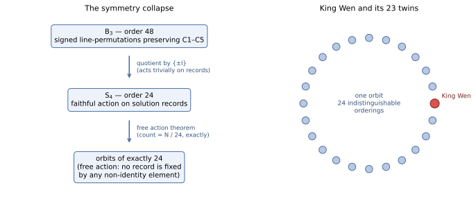

# TR-5 — Symmetry: The Automorphism Group, Free Action, and the Twins Demonstration
*Technical report — not peer-reviewed. Every claim is machine-verifiable; see the Verification Guide.*

Methods, environment pinning, statistics conventions, and artifact access: see [METHODS.md](METHODS.md).

## Executive summary

Some transformations — relabeling every hexagram by the same line-permutation, flipping all of them —
turn one valid ordering into another. This report works out the complete set of such symmetries (a group
of 48) and proves the striking consequence: **every valid ordering, King Wen included, has exactly 23
mathematically indistinguishable "twins"** that the rules cannot tell apart. None of King Wen's twins
appear in the 10.5-billion-record enumeration — direct evidence that the enumerated slice, however
large, is a biased window on the full space. The report also corrects a previously published negative
result of ours (an earlier search had missed the symmetry), and keeps that correction prominent: the
mistake and its fix are part of the record.

## Abstract
The C1–C5 constraint system admits an exact symmetry group: the **48 bit-position permutations commuting
with bit-reversal** (the centralizer of `rev` in S₆, isomorphic to **B₃ ≅ Z₂ ≀ S₃**, the octahedral group)
— proven, not sampled, and maximal inside the full hyperoctahedral group Aut(Q₆) (order 46,080). At the
canonical-record level the effective group is **B₃/{±I} ≅ S₄ (order 24)**, the action is **free** (proven
2026-07-03), so every valid ordering — not just King Wen — has exactly 23 record-level "twins" and the
orbit count is exactly N/24. The result *overturns a previously published negative*: an earlier version of
the project's own symmetry document (2026-04-25, "reaffirmed" 2026-06-11) concluded the constraint set was
rigid; its data was correct but measured budget/dedup artifacts, not solution-set asymmetry. Direct
bisection of the 560T canonical then delivered the concrete demonstration: King Wen is present, **all 23
of its twins are absent** — proving membership set-theoretically while showing budgeted presence reflects
the search's frame of reference. The methodological lesson is the report's spine: budgeted-slice
statistics cannot decide set-level properties.

*Novelty status: we are not aware of a prior statement of this symmetry group for the King Wen constraint
system; prior-art corrections are welcomed via CITATIONS.md. (Related but distinct formal work: Radisic
2026, arXiv:2601.07175, formalizes King Wen pairing optimality in Lean 4 + Mathlib — a different object.)*

## Sections
1. **Theorem and proof.** For every σ in G = C_{S₆}(rev), acting linearly on GF(2)⁶: S satisfies C1–C5 ⟺
   σ(S) does. Proof by constraint: σ is a Hamming isometry (C2, C5 — difference-wave multiset unchanged);
   coordinate permutations fix 0 and 63 (C4); linearity with σ(63) = 63 gives σ(h ⊕ 63) = σ(h) ⊕ 63, so
   complement pairs map to complement pairs at unchanged positions (C3); σ∘rev = rev∘σ gives
   σ(partner(h)) = partner(σ(h)) (C1). Maximality: any Aut(Q₆) element with a nontrivial flip moves 0 or 63
   (violates C4); each of the 672 bit permutations outside G maps King Wen to a C1-violating sequence
   (exhaustively verified 2026-07-02). Structure: rev = (0 5)(1 4)(2 3); its centralizer is Z₂ ≀ S₃ ≅ B₃,
   order 48, element orders {1:1, 2:19, 3:8, 4:12, 6:8}; rev is the central −I and fixes every
   pair-sequence, giving the record-level group S₄ (order 24).
2. **A published negative, overturned — kept in its honest framing.** The original document concluded "All
   47 falsified… the constraint set is rigid against bit-position permutations. No factor-of-2-to-48
   enumeration cost reduction is available." That conclusion was **wrong**, and the correction (2026-07-02)
   supersedes it while preserving the original data, which was and remains correct as *budgeted-yield*
   data: per-cell yields from the budget-truncated 100T log differ hugely between σ-related cells (max
   >1.5M records; ≥21,000 mismatched cell pairs per σ). Two mechanisms, neither about the solution set:
   (a) *frontier ordering* — σ permutes hexagram values hence DFS child order, so a fixed per-cell budget
   explores a different region of the isomorphic tree (equal totals, different budgeted slices); (b)
   *dedup convention* — the lex-smallest-orientation representative is not σ-equivariant, so records
   migrate between orbit-mate cells. Diagnostic confirmation: the old test's closest "near-miss" was
   σ = [5,4,3,2,1,0] (bit reversal, 43% match) — precisely the central element acting trivially on
   pair-sequences, leaving only the artifacts. The lesson is recorded in CRITIQUE.md.
3. **Empirical corroboration at three independent levels.** (i) Exhaustive σ(KW) test over all 720 bit
   permutations: exactly the 48 σ ∈ G yield valid C1–C5 sequences (the other 672 fail C1); the 48 raw
   sequences are distinct and collapse to 24 distinct canonical pair-orderings (KW + 23 twins), each with
   complement-distance sum C3 = 776 exactly. (ii) Exact tree isomorphism: for a KW-following 23-pair prefix
   and three random σ ∈ G, exact deterministic subtree counts are identical to the integer — tree_nodes =
   9,422,793 and canonical leaves = 16,504 for all four σ-related prefixes. (iii) All-cells orbit test: the
   65,281 productive 560T cells partition into 4,183 G-orbits; within-orbit CV of per-cell Knuth size
   estimates (10⁵ probes/cell) is 0.112 (median) — indistinguishable from the estimator's noise floor
   (median relerr 0.130) and 6× below the population CV (0.72). The finite component (48-of-720,
   24 record-twins) is additionally kernel-checked in Lean 4 (`sigma_kw_valid_48`,
   `valid_iff_centralizes_rev`, `twins_24_records`; lean/KingWen.lean).
4. **The free-action corollary (2026-07-03): every solution has exactly 23 twins.** The S₄ record-action
   has no fixed points off the identity: every canonical record uses all 32 pairs of the fixed C1 pairing
   position-wise; a record equals its σ-image only if σ stabilizes each pair as a set at its slot; an
   effective σ ≠ id moves at least one pair. Consequences: every orbit has size exactly 24; the orbit count
   is exactly N/24; King Wen's 23 twins are not a special property. The Burnside census the project had
   queued as a measurement is settled analytically at zero compute: all non-identity fixed-point counts are
   zero. (To our knowledge first stated here; corrections welcome via CITATIONS.md.)
5. **The twins-absent-from-560T demonstration.** Measured 2026-07-02 by direct bisection of the 560T
   canonical: **King Wen is present; all 23 twins are absent.** Their membership in the full solution set
   is proven — their absence from the budgeted set is a search-orientation effect: the enumeration's
   variable order is derived from King Wen, so KW lies on the early DFS path of its cell while each
   relabeled twin is a late leaf of its own cell. Presence in a budgeted canonical therefore reflects the
   search's frame of reference, not a mathematical property of the ordering — the strongest concrete
   illustration yet of SEARCH_SPACE_SIZE.md §"Is finding King Wen early an artifact?".
6. **Methodological lesson and consequences.** Budgeted-slice statistics cannot decide set-level
   properties: the 2026-04-25 negative was a category error (budget/dedup artifacts read as solution-set
   asymmetry), and the twins demonstration is the same error's mirror image made vivid. Corrected
   takeaways: (a) an orbit-reduction of enumeration cost (÷ up to 48 raw / 24 effective) is available in
   principle — the design (enumerate representatives, relabel + re-canonicalize) is specified but not
   implemented, and adopting it would change the canonical convention, an explicitly gated decision; (b)
   KW-structural claims should be checked for relabeling invariance — any statistic not invariant under S₄
   record-relabeling is measuring the labeling; (c) the orbit structure is a new object of study. Scope
   limit: flips are excluded by C4 specifically (they move 0/63); a C4-free system would admit a larger
   flip-extended analysis — not pursued.

## Verification Guide
- Theorem, proof, correction notice, all tables: documentation/SYMMETRY_SEARCH.md; full working notes:
  roae-private/THEOREM_C15_SYMMETRY_GROUP_2026_07.md
- σ(KW) validity over all 720 bit permutations + orbit counts: runnable ~15-line python snippet
  published in documentation/SYMMETRY_SEARCH.md §Reproducibility (<1 s; prints
  `48 of 720 valid -> 24 distinct canonical records (KW + 23 twins)`)
- Exact tree-isomorphism check (identical 9,422,793 / 16,504 for σ-related prefixes):
  `./solve --estimate-knuth 0 1 0 2 0 3 0 4 0 5 0 6 0 7 0 8 0 9 0 10 0 11 0 12 0 13 0 14 0 15 0 16 0 17 0 18 0 19 0 20 0 21 0 22 0` vs
  `./solve --estimate-knuth 0 22 1 28 0 3 1 21 1 26 0 6 1 11 0 5 0 19 0 27 0 7 1 16 1 30 1 14 0 20 0 18 1 25 0 24 1 1 1 15 0 4 0 9 0`
  (both commands also spelled out in documentation/SYMMETRY_SEARCH.md §Reproducibility)
- Lean finite component: `lean lean/KingWen.lean` (silence = all theorems check; Lean 4, tested 4.31.0)
- Original 2026-04-25 budgeted-yield phases: `./solve --symmetry-search [--validate-counts]` (output
  correct as budgeted-yield data)
- Free-action corollary + Burnside closure: SYMMETRY_SEARCH.md §Corollary; HISTORY.md 2026-07-03
- Twins-absent bisection: SYMMETRY_SEARCH.md §Limits and scope (2026-07-02 measurement)

## Figure: the symmetry collapse

*Left: the order-48 group B₃ of C1–C5-preserving signed line-permutations collapses to a faithful
S₄ (order 24) on solution records — {±I} acts trivially. Right: the free-action theorem means every
valid ordering, King Wen included, sits in an orbit of exactly 24 mutually indistinguishable orderings;
the solution count is divisible by 24, exactly.*

## Numerical instantiation (v1.6): the theorem checked against an exact count

The free-action prediction is now verified against exact arithmetic at full scale: the exact count of
pairing-preserving, no-5, Qian-Kun-anchored orderings (|C1∩C2∩C4| = 7.5706×10⁴¹, computed 2026-07-04 by
a symmetry-quotient dynamic program that itself uses this report's group) is **exactly divisible by
24**, as the theorem requires — remainder zero on a 42-digit integer. A pleasing closure: the theorem
made the computation feasible (the quotient is the reason the DP fits in memory), and the computation
then confirmed the theorem's arithmetic signature.

## Revision history
| Version | Date | Changes |
|---|---|---|
| v1.0 | 2026-07-04 | First public release |
| v1.1 | 2026-07-04 | Plain-language executive summary added; internal drafting TODOs resolved (figures kept as planned improvements) |
| v1.7 | 2026-07-04 | Reproducibility completion: Verification Guide's tree-isomorphism command spelled out in full (ellipsis removed); 720-permutation σ(KW) test published as a runnable snippet in SYMMETRY_SEARCH.md §Reproducibility; orbit-CV test given an explicit public rerun spec |
