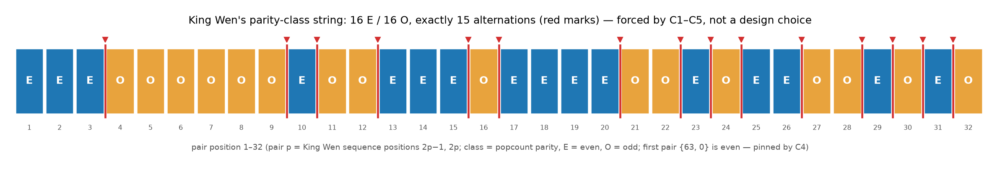

# TR-6 — The Parity Skeleton: One Theorem, Three Verifications
*Technical report — not peer-reviewed. Every MEASURED result carries a reproduction command, and every
proof cited as machine-checked names its certificate or Lean theorem; claims of scope, attribution and
interpretation are argued, not verified. One caveat is structural, and it frames all the rest: the same
author wrote the claims, the software that checks them, and this report that grades the check.
Verification here is independent in mechanism, never in authorship; no independent party has yet
audited or reproduced any of it (METHODS.md §"Authorship independence").*

⚠ **One exception to the banner's reproduction-command promise, stated here because the banner is
shared boilerplate and is not this report's to amend** (added 2026-09-02, Codex V2-F08 #3, prose batch
P37): the **cardinality-only subset experiment** cited in the Abstract's 2026-08-29 correction marker —
the ordering-variable-free clause subset of each CNF shown UNSAT on its own — **has no public
reproduction command and no public artifact.** `sat.py` exposes no subset-extraction flag;
`reports/certificates/` holds the two *full-encoding* proofs (`alt-le-14.drat.gz`, `alt-ge-16.drat.gz`)
and no subset CNF, subset proof or extractor; `reports/certificates/verify_all.sh` regenerates only the
full targets. The subset run was performed and is recorded in the project's private working notes
(2026-08-29, kissat 4.0.1 built from source, both subsets UNSAT with drat-trim-verified proofs), but a
private note is not a reproduction command: from this repository the subset result is **asserted, not
checkable**. Shipping the extractor and the two subset certificates is queued, not done.

**What this does *not* put in doubt.** The theorem, the two published full-encoding DRAT certificates,
and the "corroborating, not independent" verdict all stand without the subset artifact — the verdict
also follows from *reading* the public encoding: `sat.py`'s `BETWEEN_MULTISET` fixes the per-distance
between-pair counts (2 at d=1, 13 at d=3) and the encoding defines `odd[s]` as `T[s,1] ∨ T[s,3]`, so
|odd| = 15 identically and both alternation targets are contradicted before any ordering variable is
consulted. That reading is checkable from the tracked `sat.py` today; only the mechanical subset
demonstration of it is not.

Methods, environment pinning, statistics conventions, and artifact access: see [METHODS.md](METHODS.md).

## Executive summary

The 32 hexagram pairs come in two kinds — "even" and "odd" line-balance — and as you read the sequence,
the kind alternates: sometimes it switches, sometimes it stays. This report proves that the number of
switches is **always exactly 15** — not just in King Wen, but in every ordering that satisfies the core
constraints. A pattern that could have been an aesthetic choice is, **given C1 and C5**, a mathematical
law — with the caveat that C5 is itself a regularity read off King Wen, so "forced" here is relative to
KW-derived constraints, not to an unconstrained arranger. The proof is given three ways: a human-readable argument; a machine-checked formal proof
(Lean 4 kernel), which independently establishes both the counting step and the alternation–distance
bridge; and a logic-solver check with DRAT certificates that mechanizes the counting step (the C5
odd-distance count) under that bridge as an encoding assumption. **The prose and Lean proofs are each
sufficient alone; the SAT check re-verifies the counting core by an independent mechanism but is
corroborating rather than independently sufficient.** ⚠ **[CORRECTED 2026-08-29 — this claimed "three fully independent ways" and "any one of the three would suffice". The SAT leg is NOT independent: `BETWEEN_MULTISET` forces 2(d=1)+13(d=3)=15 odd-distance slots, so `alt-le-14` and `alt-ge-16` are refuted by the C5 cardinality clauses ALONE — verified by extracting the ordering-variable-free clause subset and showing it UNSAT on its own (kissat rc=20, DRAT `s VERIFIED`) — a run that has no public artifact; see the reproduction-gap note beneath the banner above. The encoding also ASSUMES the alternation-to-odd-distance bridge that carries the mathematical content. The THEOREM IS UNAFFECTED. See CORRECTIONS.md]**

## Abstract
In every sequence satisfying C1–C5, the 32 pairs are parity-homogeneous, split exactly 16 even / 16 odd,
and the pair ordering exhibits **exactly 15 parity-class alternations** across its 31 pair boundaries —
forced by C1+C5 rather than chosen (KW's count is 15, necessarily) — though C5 is itself a regularity read
off King Wen, so "forced" here is relative to KW-derived constraints, not to an unconstrained arranger.
The theorem has
been verified in **three modalities (two independently sufficient)**: a short prose proof (three lemmas + the C5
odd-distance count); a **Lean 4 kernel-checked general theorem** (`alternations_15_general` — every C1+C5
sequence of 64 six-bit values has exactly 15 alternations, proven by structural argument, not finite
enumeration; core Lean 4, no mathlib); and a **SAT decision** (both "≤14 alternations" and "≥16
alternations" are UNSAT under C1+C2+C4+C5, with DRAT certificates independently verified by drat-trim).
Building the SAT encoding surfaced and corrected a four-cell tabulation error in the published
within/between-pair distance decomposition — formalization is the project's best error detector. The
skeleton sits beneath a genuine literature lineage of empirical parity observations (Zhu Yuansheng, 13th
c. → [Schulz 1990](../documentation/CITATIONS.md#schulz1990-motifs) → [Moore 2005](../documentation/CITATIONS.md#moore2005)), which the theorem does not derive from but visibly rhymes with: those are
KW-specific observations; this is a forced property of the constraint system that every valid ordering
inherits.

## Sections
1. **The theorem and its prose proof.** Lemma 1 (pairs are parity-homogeneous): popcount(partner(h)) ≡
   popcount(h) (mod 2) — bit reversal preserves popcount exactly; complement gives 6 − popcount(h). Lemma 2
   (16/16 class split): 32 hexagrams of each popcount parity, pairs lie wholly inside one class (verified
   exhaustively). Lemma 3 (transition parities): within-pair transitions have even Hamming distance
   (reverse-pairs d ∈ {2, 4, 6}; complement-pairs d = 6); a between-pair transition has parity ε(p) ⊕ ε(q),
   independent of orientation choices. Theorem: C5 fixes the 63-transition distance multiset at
   {1:2, 2:20, 3:13, 4:19, 6:9}, containing exactly 2 + 13 = **15 odd distances**; all odd transitions are
   between-pair, and their count equals the number of adjacent class-alternations — hence exactly 15.
   Corollary: summing parities recovers the wrap-around-parity theorem ([SPECIFICATION.md](../documentation/SPECIFICATION.md)). The theorem
   generalizes it and supplies the "novel structural theorem" the earlier C5-tightening investigation
   concluded would be required for any further provable pruning.
2. **The corrected within/between decomposition.** Designing the CNF encoding of C5 required the exact
   within/between-pair distance split — and the recomputation contradicted [CRITIQUE](../documentation/CRITIQUE.md)'s published table.
   True values (machine-checked, summing exactly to C5's multiset): within-pair **{2:12, 4:12, 6:8}** (was
   11/13/8), between-pair **{1:2, 2:8, 3:13, 4:7, 6:1}** (was 2/7/14/7/1). The "14 threes" belongs to the
   circular reading (wrap-around adds one), consistent with [McKenna's](../documentation/CITATIONS.md#mckenna-mckenna1975) own circular framing and this
   theorem; the "4×" concentration prose was a delta-misread-as-ratio (true linear excess ≈1.3×). Fixed
   with correction notes. The pattern repeats across the project: every time a claim must be re-derived
   for a machine (Lean, the estimator, now SAT), latent errors surface.
3. **Modality 2 — Lean, machine-checked.** lean/KingWen.lean (core Lean 4 only, no mathlib) first pins the
   finite lemmas by kernel `decide` (`partner_preserves_parity`, `parity_split_32_32`,
   `xor_parity_identity`; plus `kw_alternations_15` — King Wen's own count) — **kernel-only** (a clean
   2026-07-31 build confirms `#print axioms` = `[propext]`, no `native_decide`, so nothing here trusts
   Lean's compiler; see lean/README.md's trust-base note). Tier 2b (2026-07-03) then
   proves the **general theorem**: `alternations_15_general` — every C1+C5 sequence of 64 six-bit values
   has EXACTLY 15 parity-class alternations, by structural proof (transitions-as-range-map bridge lemma;
   index-parity split via a kernel-decided permutation of range 63; within-pair evenness from C1; the C5
   odd-transition count). With `wrap_parity_general` (Tier 2, same day), both sequence-level theorems of
   the project are kernel-verified for ALL valid sequences — the Lean layer is no longer just "finite
   facts checked."
4. **Modality 3 — SAT, certificate-verified.** The SAT layer (`sat.py`, encoding derived from solve.py's
   constraint definitions, external kissat solver) decides both directions exactly: "≤14 alternations" and
   "≥16 alternations" are **UNSAT under C1+C2+C4+C5** — a mechanized corroboration of the counting step.
   Certificates are archived and independently verified: drat-trim (2026-07-03) checks `s VERIFIED` for
   both alt-le-14 and alt-ge-16 (and the two other project UNSAT proofs) against regenerated CNFs. The
   encoder's round-trip validation's first solver model, pleasingly, is King Wen itself. Three modalities,
   three failure surfaces: a prose proof can hide a lemma gap, a Lean proof trusts the formalization of
   the statement, a SAT proof trusts the encoding — their agreement is the point.
5. **Consequences.** (a) A provable, orientation-free skeleton constraint: the class pattern (a string of
   16 E's and 16 O's) must contain exactly 15 changes — only 82,818,450 of C(32,16) = 601,080,390
   arrangements do, a ×7.26 reduction at the arrangement level, and C4 pins the first pair to the even
   class (pair {63, 0}). (b) An O(1) exact prefix prune (two-sided achievable-alternation interval check),
   exact by derivation, firing from the earliest placements. (c) Sha-lineage caveat: an exact prune
   preserves the solution set but changes node-visit ordering and counts, so budgeted canonical outputs —
   and canonical shas — would change; production adoption is a gated lineage decision. Nothing in the
   published canonicals is affected by the theorem itself. (d) Combined with the symmetry theorem ([TR-5](TR5_SYMMETRY.md)),
   the solution space has two proven skeletons: a 48-element relabeling group and a rigid 15-alternation
   parity profile — both properties of the constraint system, which KW satisfies necessarily rather than
   by choice; subject to the Abstract's caveat, since C5 is itself read off King Wen, so the necessity is
   relative to KW-derived constraints.
6. **The lineage atop the skeleton (attribution).** To our knowledge the theorem as stated (the exact
   15-alternation count as a *forced* property of C1–C5) is first proven here; given how deep this
   literature runs, we state that with humility — corrections and prior-art pointers are welcomed via
   CITATIONS.md. The empirical parity observations sitting atop the skeleton deserve their credits as
   cousins of (not sources for) the theorem: **Zhu Yuansheng (13th century)** first recognized the single
   exception to the gender/position-parity rule (per [Schulz 2018](../documentation/CITATIONS.md#schulz2018), fn. 42); **Schulz (1990, *JCP* 17:3)**
   stated that rule over his 36 consolidated units — the strongest measured literature discriminator at the
   time of the SAT work (×11,364), later exceeded by the data-like S25–28 configuration at ×5×10⁷ (see
   [LITERATURE_RULES_POPULATION_TESTS.md](../documentation/LITERATURE_RULES_POPULATION_TESTS.md),
   headline finding 1, "A new strongest discriminator") — with
   exceptions at stations 25–26 (elaborated by [Cook 2006](../documentation/CITATIONS.md#cook2006); attribution corrected 2026-07-03 upon first-hand
   reading — Cook had been credited as primary); **Moore (2005, *Oracle Papers* No. 1)** stated the
   yin/yang pair-positioning parity rule over the 32 pair positions (King Wen complies 16/18). Cook (2006)
   separately states a gender/position-valence rule over his 36-class ordering. All are empirical,
   KW-specific, over different partitions; the theorem differs in kind — every valid ordering has exactly
   15 alternations — derived and machine-checked independently of each source, but the family resemblance
   is real and the credits stand.

## Figure

*King Wen's parity-class string. Each square is one of the 32 pairs in sequence order (pair p = King Wen
positions 2p−1, 2p); its class is the popcount parity of its hexagrams (parity-homogeneous per Lemma 1, so
the first member determines it). The split is exactly 16 E / 16 O (Lemma 2), the first pair {63, 0} is even
(pinned by C4), and the red marks count exactly 15 alternations — the theorem's forced value, which every
C1–C5-valid ordering shares. Computed directly from solve.py's King Wen sequence by
[`viz/report_figures.py`](../viz/report_figures.py); [SVG](figures/fig_tr6_parity_alternations.svg).*

## Verification Guide
- Theorem statement, lemmas, arrangement count: [documentation/PARITY_ALTERNATION.md](../documentation/PARITY_ALTERNATION.md) (lemma claims and KW's
  count verifiable in seconds from SPECIFICATION.md / solve.py; the arrangement count is the elementary
  compositions identity Σ_start C(15, blocks_E−1)·C(15, blocks_O−1); no enumeration data needed)
- Lean general theorem: `lean lean/KingWen.lean` (silence = all theorems check; Lean 4, tested 4.31.0) —
  `alternations_15_general`, `wrap_parity_general`, plus the finite lemmas
- SAT UNSAT both sides: `python3 sat.py --emit-cnf alt-le-14 f.cnf && kissat f.cnf` (and alt-ge-16);
  drat-trim verification record: [documentation/LITERATURE_RULES_POPULATION_TESTS.md](../documentation/LITERATURE_RULES_POPULATION_TESTS.md) §SAT-decided
- Corrected decomposition + error narrative: [documentation/HISTORY.md](../documentation/HISTORY.md) 2026-07-02 ("four-cell tabulation
  error"); corrected table in documentation/CRITIQUE.md
- Lineage and full citations: documentation/CITATIONS.md §Attributed candidate rules
- Wrap-parity corollary source theorem: documentation/SPECIFICATION.md

## Corollary (added v1.3): exactly 30 parity switches, always

⚠ **Every `--estimate-knuth` command in this document requires a stack limit of at least 16 MB** — `ulimit -s 16384` suffices, and `ulimit -s unlimited` is one way to satisfy it, not the requirement itself. Under the default 8 MB stack the estimator does not start: `main` allocates a ~7.23 MB frame and `estimate_tree_knuth` a further ~1.02 MB (since 2026-08-21 the binary refuses with an actionable message; previously a bare SIGSEGV). *(Added 2026-08-21, an execution-lane finding — `scripts/exec_lane.sh` executes every documented command on a default environment; the same-day warning propagation (`1e4bd04a`) covered the four estimator guides but missed this file.)* *(Narrowed 2026-09-02, Codex V2-F08 #4, prose batch P37: `ulimit -s unlimited` is a **sufficient** setting that had been published as a **necessary** one — and one that a host or container with a hard stack cap cannot even apply, so the published requirement was a false blocker there. `solve.c`'s `--estimate-knuth` preflight tests `rlim_cur != RLIM_INFINITY && rlim_cur < 16UL*1024*1024` and its message names ">= 16 MB". EXECUTED under TR-9 v1.24 on a locally built binary: `ulimit -s 8192` refuses and exits 1, `ulimit -s 16384` runs the estimator to completion. `solve.c`'s own remedy line still prescribes only `unlimited` and is queued to offer both. This is the sibling propagation of the narrowing TR-9 made on 2026-09-02 and reported but did not sweep.)*

The transition-parity string (63 values: transition i is "odd" iff an odd number of lines change)
switches value exactly **30 times** in every C1+C5-valid ordering. Proof: every within-pair transition
is even (reversal preserves line-count parity; the four inverse pairs jump all 6 lines), so odd
transitions occupy only the 31 between-pair slots — pairwise non-adjacent and excluding both string
ends; the main theorem gives exactly 15 odd between-pair transitions; 15 isolated interior odd values
contribute two switches each. Discovered as a pre-registered F4' functional that came back CONSTANT
(min=max=30 over 2×10⁹ population probes; archived run output: the `par_switch` row of
[evidence/f4p_tier1.out](evidence/f4p_tier1.out), regenerable via `SOLVE_KNUTH_SCORE_F4P=1 ./solve
--estimate-knuth 2000000000` — flag documented in [SOLVE_C_CLI.md](../documentation/SOLVE_C_CLI.md)) before being proved — the measurement
found the theorem. As of v1.4 the corollary is also machine-checked: `switches_30_general` in
lean/KingWen.lean (a structural proof checked by the kernel; core Lean, no mathlib) — the same
three-modality status as the main theorem.

## Revision history
| Version | Date | Changes |
|---|---|---|
| v1.0 | 2026-07-04 | First public release |
| v1.1 | 2026-07-04 | Plain-language executive summary added; internal drafting TODOs resolved (figures kept as planned improvements) |
| v1.2 | 2026-07-04 | Figures added |
| v1.3 | 2026-07-04 | 30-switches corollary added (found by F4' population measurement, then proved) |
| v1.4 | 2026-07-04 | Corollary machine-checked: switches_30_general kernel-verified in lean/KingWen.lean |
| v1.5 | 2026-07-04 | Reproducibility completion: F4' discovery-measurement evidence published (reports/evidence/f4p_tier1.out) and cited from the corollary; `SOLVE_KNUTH_SCORE_F4P` documented in SOLVE_C_CLI.md |
| v1.6 | 2026-07-11 | Trust-base wording precision: §3's modality heading is "machine-checked" (its finite lemmas were `native_decide` — extended trust base per lean/README.md — until the 2026-07-31 kernel migration, see v1.7); the general theorems (`alternations_15_general`, `wrap_parity_general`, `switches_30_general`) remain kernel-checked structural proofs, stated as such. No result changes |
| v1.7 | 2026-07-31 | **Kernel-only trust base restored (post-merge, authoritative `#print axioms`).** The `wip-h2c3` kernel migration landed on main; §3's finite lemmas (`partner_preserves_parity`, `parity_split_32_32`, `xor_parity_identity`, `kw_alternations_15`) are now **kernel-only** — a clean 2026-07-31 build confirms `[propext]`, no `native_decide`. §3 modality-2 wording updated from the v1.6 `native_decide`/extended-trust-base phrasing. No result changed |
| v1.8 *(current)* | 2026-09-02 | **Three claims conditioned, qualified or disclosed, and the stack requirement narrowed (prose batch P37, Codex V2-F08 #1–#4).** (1) **The forcing claim now states its premise.** The Executive summary, Abstract and §5(d) presented the 15-alternation count as forced against an unconstrained arranger ("a mathematical law", "not a King Wen choice", a property KW "inherits rather than chooses"). It is forced **given C1 and C5**, and C5 is itself read off King Wen — [METHODS.md](METHODS.md) grades it "Extracted from KW (confirmatory, not predictive)". [TR-7](TR7_CIRCULAR_READING.md) §3 made this exact correction on 2026-07-20 (v2.1, adversarial-review F-14a) and it had reached none of the four sibling sites; the fourth, [PARITY_ALTERNATION.md](../documentation/PARITY_ALTERNATION.md), is corrected in the same pass. (2) **§6's Schulz superlative is dated.** "The strongest measured literature discriminator" now reads "…at the time of the SAT work (×11,364), later exceeded by the data-like S25–28 configuration at ×5×10⁷", the ranking [CITATIONS.md](../documentation/CITATIONS.md) has carried all along. (3) **The Abstract's subset experiment is disclosed as not publicly reproducible.** The 2026-08-29 correction marker justifies the independence retraction with an ordering-variable-free clause subset shown UNSAT alone; `sat.py` has no subset flag, `reports/certificates/` holds no subset CNF or proof, and `verify_all.sh` regenerates only the full targets. The run was performed and is privately recorded, and a new paragraph beneath the banner says so, says that a private note is not a reproduction command, and shows that the retraction itself follows from *reading* the tracked `sat.py` regardless. Shipping the extractor and the two subset certificates is queued, not claimed. (4) **Stack requirement narrowed to what the binary enforces (prose batch P37, Codex V2-F08 #4; wording only).** The `--estimate-knuth` warning published `ulimit -s unlimited` as REQUIRED. It is a **sufficient** setting, not a necessary one, and on a host or container whose hard limit forbids `unlimited` the published requirement was a false blocker. `solve.c`'s preflight tests `rlim_cur != RLIM_INFINITY && rlim_cur < 16UL*1024*1024` and its message names ">= 16 MB"; executed under TR-9 v1.24, `ulimit -s 8192` refuses and exits 1 while `ulimit -s 16384` runs the estimator to completion. The banner now states "at least 16 MB (`ulimit -s 16384` suffices)" with `unlimited` named as one sufficient setting. This is the sibling sweep TR-9 v1.24 reported but did not perform. No figure, count, command, claim or scope changes. **No theorem, count, certificate or verdict changes; the 15-alternation result and both DRAT proofs stand exactly as published** |
