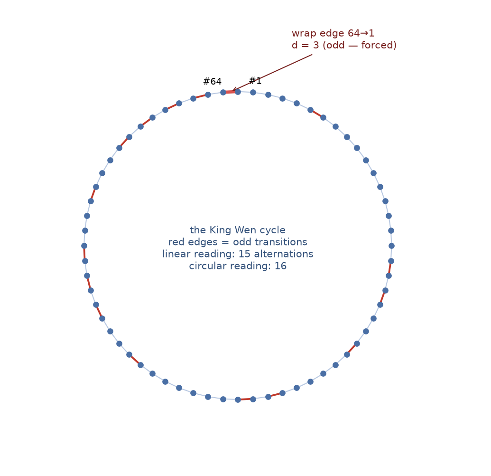

# TR-7 — The Circular Reading
*Technical report — not peer-reviewed. Every MEASURED result carries a reproduction command, and every
proof cited as machine-checked names its certificate or Lean theorem; claims of scope, attribution and
interpretation are argued, not verified. One caveat is structural, and it frames all the rest: the same
author wrote the claims, the software that checks them, and this report that grades the check.
Verification here is independent in mechanism, never in authorship; no independent party has yet
audited or reproduced any of it (METHODS.md §"Authorship independence").*

Methods, environment pinning, statistics conventions, and artifact access: see [METHODS.md](METHODS.md).

## Executive summary

What if the sequence is a circle — the last hexagram wrapping around to the first? Several scholars,
notably [Terence McKenna](../documentation/CITATIONS.md#mckenna-mckenna1975), read it that way. This report re-derives the mathematics under the circular
reading. Two results stand out. First, the wrap-around step is **forced to be odd** (proved formally),
which makes McKenna's observed 3-to-1 ratio of even-to-odd transitions a necessity, not a choice.
Second, a surprise: the sequence's missing distance-5 transition is a **genuine extra rule** in the
circular reading — orderings that wrap at distance 5 make up 17.4% of the valid space, yet **not one**
appears among 10.5 billion enumerated records. That gap between the full space and the enumerated
slice is a stark demonstration of why bounded search results need independent
measurement — and why we decided this rule, though real, stays documented rather than adopted.

## Abstract
McKenna & McKenna (1975) read the King Wen sequence as a *cycle* — position 64 wrapping to position 1 —
and their published counts (64 transitions, "three even integers to each odd integer") depend on that
closure. We work out exactly what the ROAE constraint system says under the circular reading. Three
theorems and one SAT decision result: (i) the wrap-around Hamming distance d(s₆₃, s₀) is odd for *every*
C4+C5-valid ordering — now machine-checked in Lean 4 at full generality (`wrap_parity_general`, structural
induction, not finite enumeration); (ii) McKenna's exact 3:1 even:odd transition ratio is a *forced
consequence* of C4 + C5 plus the XOR parity identity — a regularity he read as a design feature that turns
out to be a theorem, not a choice; (iii) every valid circular reading has exactly 16 parity-class
alternations, and the first and last hexagrams of any valid linear ordering lie in opposite
popcount-parity classes. Finally, the circular form of C2 ("no 5-line transition anywhere on the cycle")
is a *genuine* extra constraint: valid linear orderings with a 5-line wrap exist (SAT-decided, explicit
witness) even though exactly zero appear among the 10,525,271,997 records of the deepest canonical slice;
the full-space wrap-distance masses are measured at d=1: 17.5%, d=3: 65.2%, d=5: 17.4% (2×10¹⁰
weighted-Knuth probes; independently reproduced by the archived v2.0 r6 run —
[`evidence/r6/rc1c_primary.out`](evidence/r6/rc1c_primary.out): 17.45 / 65.18 / 17.37% — agreeing
within 0.05 percentage points per class; per-class ± figures were not emitted by the instrument, so
the two-run agreement is the published uncertainty statement). The operator's
documented decision: circular C2 is *not* promoted into the constraint system — the circular reading is
McKenna's interpretive frame, not an attested property of the received artifact.

## Sections
1. **The circular frame and its provenance.** McKenna & McKenna (1975, *The Invisible Landscape*, Part
   Two, Ch. 9) constructed their difference wave over 64 transitions *including* the wrap s₆₃ → s₀ (KW's
   wrap has Hamming distance 3) — the circular reading is theirs, with full attribution (CITATIONS.md,
   [MCKENNA.md](../documentation/MCKENNA.md)). What closure does *not* touch: C1, C3, C4 are position/pair properties, unaffected. What
   it touches: the transition multiset (C5) gains a 64th member, and C2 acquires a 64th application — the
   wrap itself.
2. **The wrap-parity theorem, three ways.** For any sequence satisfying C4 and C5, the wrap distance
   d(s₆₃, s₀) is odd — proven via the XOR parity identity (popcount(a⊕b) ≡ popcount(a)+popcount(b) mod 2).
   KW's wrap is d = 3. Verification stack: (a) the prose proof ([SPECIFICATION.md](../documentation/SPECIFICATION.md)); (b) the Lean 4
   kernel-checked general form `wrap_parity_general` — verified for EVERY C4+C5 sequence of 6-bit values by
   structural induction (telescoping transition-parity lemma + sum-parity/odd-count machinery), upgrading
   the formal core from "finite facts checked" to "sequence-level theorem proven"; (c) empirical
   corroboration at the d3 560T canonical (10,525,271,997 records, sha 9a968fa2…): 100.000000% odd wrap —
   necessarily, since [`solve --verify`](../documentation/SOLVE_C_CLI.md#--verify) enforces the C4+C5 hypotheses; the theorem holds deductively, the
   enumeration validates the implementation.
3. **McKenna's 3:1 is forced, not designed.** His "perfect ratio of three to one" (16 odd of 64 circular
   transitions, 25.00% exact) is the circular reading of the wrap-parity theorem plus C5's 16-odd-of-64
   count. Every C4+C5-valid ordering has it. McKenna discovered the ratio empirically before its proof was
   articulated here — one of his most accurate quantitative claims, and stronger than he may have realized:
   **forced given C4 + C5**, and hence not an independent design choice *within* that constraint system — though C5 is itself a regularity read off King Wen, so "forced" here is relative to KW-derived constraints, not to an unconstrained arranger.
4. **What closure changes: circular C5 and the 16-alternation corollary.** Under closure KW's transition
   multiset becomes {1:2, 2:20, **3:14**, 4:19, 6:9} (the d=3 count rises 13→14); orderings with d=1 wraps
   read {1:3, …, 3:13, …} instead. The parity-alternation theorem ([PARITY_ALTERNATION.md](../documentation/PARITY_ALTERNATION.md); Lean
   `alternations_15_general`) forces exactly 15 alternations linearly; on the cycle the count must be even
   and the wrap boundary is forced to alternate (equivalent to wrap parity — two routes to one fact).
   **Corollary: every valid circular reading has exactly 16 alternations**, and the first and last
   hexagrams of any valid linear ordering lie in opposite popcount-parity classes (KW: 63 even → 42 odd ✓).
5. **Circular C2 is a genuine extra constraint — the SAT decision.** The wrap-parity theorem restricts the
   wrap to d ∈ {1, 3, 5}. At the 560T canonical the wrap is d=3 in 91.83% of records, d=1 in 8.17%, and
   d=5 in **exactly zero of 10,525,271,997**. Nevertheless, valid linear orderings with a 5-line wrap
   EXIST — SAT-decided (2026-07-03) with an explicit C1–C5-valid witness (final pair (32, 1); wrap
   d(1, 63) = 5; complement-distance sum 752). So the circular reading is *not* free: it excludes real
   members of the linear solution set. Per the twins lesson ([SYMMETRY_SEARCH.md](../documentation/SYMMETRY_SEARCH.md)), budgeted-slice absence
   does not measure full-space rarity — and the full-space wrap-distance masses are now MEASURED (2×10¹⁰
   weighted-Knuth probes, 2026-07-03; estimator per METHODS.md; mass ratios are
   heavy-tail dominated — small probe budgets will not resolve them):
   **d=1: 17.5%, d=3: 65.2%, d=5: 17.4%**. Uncertainty, stated from archived artifacts (2026-07-26):
   the instrument prints point masses without per-class CIs, so no ± figure is quoted; instead the
   independent 2×10¹⁰-probe v2.0 r6 run ([`evidence/r6/rc1c_primary.out`](evidence/r6/rc1c_primary.out),
   2026-07-10) re-measured the same three masses at **17.45 / 65.18 / 17.37%** — two independent draws
   agreeing within **0.05 percentage points per class**, which bounds the run-to-run scatter at the
   precision every figure here is quoted to. The 5-wrap orderings that
   no budgeted slice has ever contained are between a fifth and a sixth of the full space; circular C2
   would cut the space by ×1.21.
6. **The non-promotion decision, on the record.** Operator decision 2026-07-03: circular C2 is documented,
   NOT promoted, and not implemented in solve.c in any form. Rationale (consistent with the R-series
   non-promotion discipline): the circular reading is McKenna's interpretive frame, not an attested
   property of the received artifact; enforcing it would add a reverse-engineered constraint. The
   implementation analysis, for the record: as a pure leaf-emission filter it would be byte-identical to
   the current lineage at every published canonical scale (zero 5-wrap records exist in any slice —
   divergence begins only in territory no budget has reached, as the SAT witness proves); as a prune it
   would change node consumption and open a new sha lineage. Neither is warranted. Closure also invites a
   larger symmetry question — without C4, a circular system would be invariant under the 32 pair-slot
   rotations as well as the B₃ relabelings — but under the actual system (C4 kept) the circular reading
   changes nothing about the symmetry group.

## Verification Guide
- Wrap-parity theorem, statement + proof: documentation/SPECIFICATION.md §Theorem (Wrap-around parity is
  odd)
- Lean general form: `lean lean/KingWen.lean` (Lean 4, tested 4.31.0; silence = all theorems check) —
  `wrap_parity_general`, supporting lemmas `transitions_sum_parity`, `sum_parity_odd_count`,
  `odd_count_partition`; see lean/README.md §Tier 2
- 560T wrap measurement (91.83% d3 / 8.17% d1 / zero d5): `./solve --verify-wrap-parity` against the d3
  560T canonical (sha registry: [documentation/CANONICAL_HASHES.md](../documentation/CANONICAL_HASHES.md)). Note: this mode's printed theorem
  line formerly claimed "C2 forbids 5 → d ∈ {1,3}", contradicting §5's SAT result; corrected in public
  commit `0c24637` (2026-07-03) to state d ∈ {1,3,5} with d=5 not excluded by linear C2 (tabulator was
  always correct; stdout/comment only, selftest sha unchanged)
- Wrap-d5 witness: `python3 sat.py --witness wrap-d5` → the explicit 64-hexagram sequence in
  [documentation/CIRCULAR_KING_WEN.md](../documentation/CIRCULAR_KING_WEN.md), C1–C5-valid, wrap d = 5
- Full-space wrap masses: `SOLVE_KNUTH_SCORE=1 ./solve --estimate-knuth 20000000000` (2×10¹⁰ probes,
  the budget behind the published 17.5/65.2/17.4% figures; the scorer prints point masses without
  per-class CIs — the published uncertainty statement is the two-run agreement in §5
  — and mass *ratios* are heavy-tail dominated, so small budgets (~10⁵ probes) will NOT
  reproduce them; this is an hours-scale run on many-core hardware. Method self-validation in
  [documentation/SEARCH_SPACE_SIZE.md](../documentation/SEARCH_SPACE_SIZE.md))
- 16-alternation corollary ingredients: documentation/PARITY_ALTERNATION.md + Lean
  `alternations_15_general`
- Non-promotion decision + rationale: documentation/CIRCULAR_KING_WEN.md §Status decision (operator,
  2026-07-03)
- Attribution: the circular reading is McKenna & McKenna (1975); the wrap-parity theorem, its 560T
  measurement, the alternation corollary, and the wrap-d5 SAT decision are ROAE (to our knowledge —
  corrections welcome via documentation/CITATIONS.md)

## Figure: the cycle

*The 64 hexagrams as a cycle in King Wen order (computed from the sequence itself). Red edges are odd
transitions; the highlighted wrap edge 64→1 jumps d = 3 — odd, as the wrap-parity theorem forces. The
circular reading has 16 odd transitions where the linear reading has 15: the wrap adds exactly one,
always.*

## Prior work note (v1.7)

[Peter Meyer](../documentation/CITATIONS.md#meyer1998) (1998, web) published the complete cyclic line-change sequence of the King Wen order —
the 64 Hamming distances including the wraparound term — with an explicit XOR-and-popcount
formalization (see CITATIONS.md). His data thus contains the wrap value d=3 this report analyzes,
decades before this work; the wrap-parity theorem, the d in {1,3,5} space analysis, and the
17.4%-vs-absent measurement remain, to our knowledge, first stated here. Found during a bibliography
review 2026-07-04; corrections welcome.

## Corollary (added v1.8): exactly 32 parity switches in every circular reading

The circular transition-parity string (64 values: transition i is "odd" iff an odd number of lines
change, the wrap included) switches value exactly **32 times** in every C1+C4+C5-valid ordering.
Proof: index the 64 cyclic transitions 0..63, transition i connecting positions i and i+1 (mod 64,
0-indexed); pair p occupies positions 2p and 2p+1, so within-pair transitions sit at the 32 even
indices and are all even (C1: reversal preserves line-count parity; the four self-reverse pairs are
complement pairs, d = 6), while between-pair transitions sit at odd indices 1..61 and the wrap at
index 63 — also odd. The parity-alternation theorem ([TR-6](TR6_PARITY_SKELETON.md)) gives exactly 15 odd between-pair
transitions, and the wrap-parity theorem (§2) makes the wrap odd, so there are exactly 16 odd
transitions (McKenna's 16-of-64, §3), all confined to odd cyclic indices. Adjacent indices on a
64-cycle have opposite index parity (including the 63/0 seam), so the 16 odd transitions are pairwise
non-adjacent — 16 isolated values, each contributing exactly two switches: 32. The result is invariant
across the wrap's distance class (d ∈ {1, 3, 5} are all odd). This fills the one remaining cell in the
TR-6/TR-7 linear→circular lattice: alternations 15 → 16 (§4), switches 30 (TR-6 corollary) → **32**.
Verified on King Wen: cyclic odd transitions = 16, all at odd indices; linear switches = 30; cyclic
switches = 32. Derived in cross-report synthesis 2026-07-04 (composition of TR-6's 30-switches
corollary with this report's wrap-parity theorem), independently re-derived and re-verified before
folding in.

*Verification:* both ingredient theorems are kernel-checked (`switches_30_general`,
`wrap_parity_general` in lean/KingWen.lean); the KW instance is a three-line check from solve.py's
`binary_hexagrams` (count sign changes of the cyclic Hamming-distance parity string).

## The anchors on the circle (added v1.9)

The sequence's two endpoint pairs are individually distinguished: the pure pair {Qian, Kun} that opens
it (C4) and the alternating pair {Jiji, Weiji} that closes it — [Cook 2006](../documentation/CITATIONS.md#cook2006)'s
"pure opens, mixed closes," measured linearly as the final-pair anchor (7.84% of C1–C5 mass,
[LITERATURE_RULES_POPULATION_TESTS.md](../documentation/LITERATURE_RULES_POPULATION_TESTS.md)). They are
also the only *intrinsically* extremal pairs: the unique pair of run-length-6 (constant) hexagrams and
the unique pair of run-length-1 (strictly alternating) hexagrams. Under McKenna's circular reading the
two observations become one: **the two anchor pairs are neighbors on the circle** — KW places the
alternating pair in the last slot, adjacent to the pure pair across the wrap.

How much of that is forced? Three theorems (elementary; each exhaustively verified by finite computation
over the 64 hexagrams / 32 pairs — a Lean formalization is planned, see the Verification Guide):

(i) *Transition rigidity (T1):* every hexagram of the pure pair is at Hamming distance exactly 3 from
every hexagram of the alternating pair (an alternating 6-bit string has exactly three 1s, so it differs
from 111111 and from 000000 in three positions each) — so an anchor adjacency, wherever it occurs and
however oriented, is a d = 3 transition: C2-legal, odd, one unit of the largest odd budget class. In
particular KW's wrap distance 3 (§2) is forced by *which pair closes*, not by any orientation choice.

(ii) *Seam eligibility (T2i):* pairs are parity-homogeneous (16 even / 16 odd — [TR-6](TR6_PARITY_SKELETON.md)
ingredients), and the wrap-parity theorem (§2) then forbids all 16 even pairs — including all four
self-reverse pairs and the pure pair itself — from ever occupying the final slot.

(iii) *Pair-determined wrap (T2ii):* for each of the 16 eligible (odd) pairs the wrap distance is a
function of the pair alone (orientation-free), classifying them **10 : 3 : 3** into d = 3, 1, 5 closers
(the 4 antipalindromic pairs — A₂ among them — plus the 6 popcount-3 reverse-pairs at d = 3; the 3
popcount-5 reverse-pairs at d = 1; the 3 popcount-1 reverse-pairs at d = 5; the wrap-d5 SAT witness of
§5, which closes on (32, 1), is one of the latter — consistent). Eligibility is a *necessary* condition:
that all 16 eligible pairs are actually realized as closers is not proven here (the measured wrap masses
show every class is realized, and explicit witnesses realize A₂ and (32, 1)).

The measured full-space wrap masses (§5: 65.2 / 17.5 / 17.4% for d = 3 / 1 / 5) sit remarkably close to
the bare eligible-pair-counting baseline (62.5 / 18.75 / 18.75%) — the wrap-distance profile is, to first
order, pair-counting, with only a mild residual tilt toward d = 3. (Hedge: the baseline is a heuristic
reference, not a null; per-class CIs are heavy-tail dominated per §5; the per-pair spread within classes
is unknown except for A₂.)

**This re-prices Cook's anchor.** Against the naive 1/31 ≈ 3.2% the measured 7.84% looks like a ×2.4
enrichment, but the parity-forced eligibility baseline is 1/16 = 6.25%, so of that apparent enrichment
×1.9 is parity-forced (it holds for *every* C4+C5 ordering) and only **×1.25 is the contingent residual**
(7.84 / 6.25). Within its own d = 3 class A₂ carries 7.84% against a 6.52% class average (the other nine
d = 3 closers average 6.37%) — mildly, not dramatically, over-represented.

**Measured circular anchor adjacency (v2.0).** What remains genuinely contingent is the adjacency
*placement* itself. Its circular population frequency — R-C1c, the weighted C1–C5-mass fraction in
which the alternating pair occupies slot 2 or slot 32 — was pre-registered above (v1.9) and has now
been measured (2×10¹⁰ weighted-Knuth probes; evidence `evidence/r6/rc1c_primary.out`): **13.05% of
C1–C5 mass** (slot 32: 7.85%, reproducing the published R-C1 = 7.84% — the built-in scorer gate;
slot 2: 5.20%). Against the pre-registered references that is ×2.0 the uniform-slots baseline
(6.45%) and ×1.66 the eligibility-adjusted lower bound (7.84%). The descriptive A₂ slot histogram
is U-shaped: slot 2 is the largest non-final slot (5.20%, vs 3.84% at slot 3 and a 2.68% minimum at
slot 17), so the alternating pair is enriched at *both* circle-adjacent slots, not merely
late-biased — though slot 32 remains the global maximum. The KW ground truth (slot 2 = 0,
slot 32 = 1, adjacent = 1) and the negative control (the wrap-d5 SAT witness scores adjacent = 0)
were verified in both languages before the run. In plain terms: roughly one in eight valid
orderings places the two anchor pairs adjacent on the circle — KW's configuration is
population-common, and this measurement prices it; it does not elevate it. Likewise the *circular
solution-space size* is now measured: the C5-budget-override walk passed its self-gate (the
standard-multiset override reproduces N_lin byte-identically) and gives N(M′) = 6.507×10³⁷
(95% CI [6.50, 6.51]×10³⁷) with wrap-d1 mass f₁(M′) = 0.175, so the exact decomposition yields
**|C_circ| = 0.652·|C1–C5| + 0.175·6.507×10³⁷ ≈ 9.80×10³⁷ — about 0.74× the linear space**
(using the fresh run's f₃ = 0.6518 instead of the published 0.652 changes nothing at 3
significant figures). This resolves the one report-only R-series observable registered in v1.9;
per the §6 non-promotion decision it is measurement and theorem, not constraint — neither the
circular reading (McKenna's frame) nor the anchor rule (Cook's observation) enters the formal
system.

*Attribution: circular frame McKenna & McKenna (1975); the final-pair anchor rule Cook (2006); the
rigidity/eligibility theorems, the 10:3:3 classification, and the eligibility-adjusted re-pricing are
ROAE (to our knowledge first stated here — the ingredients are elementary and may appear elsewhere;
corrections welcome via [CITATIONS.md](../documentation/CITATIONS.md)).*

### Verification Guide additions (v1.9)
- Anchor rigidity (T1) + seam eligibility (T2i) + 10:3:3 classification (T2ii): exhaustive finite
  re-check in one Python session from `solve.py`'s `binary_hexagrams`; a Lean formalization
  (`anchor_cross_distance_three`, `no_even_pair_closes`, `closer_classes_10_3_3`) is planned for
  `lean/KingWen.lean` (PENDING, not yet merged).
- Circular anchor adjacency R-C1c + A₂ slot histogram:
  `SOLVE_KNUTH_SCORE=1 ./solve --estimate-knuth 20000000000` (KW gate: slot2 = 0, slot32 = 1,
  adjacent = 1; d5-witness negative control = 0; the run's slot-32 mass must reproduce
  R-C1 ≈ 7.84% — measured run: `evidence/r6/rc1c_primary.out`, adjacent = 0.130472).
- Circular-space size:
  `SOLVE_KNUTH_C5_BUDGET="1:1,2:20,3:14,4:19,6:9" SOLVE_KNUTH_SCORE=1 ./solve --estimate-knuth 20000000000`
  (self-gate: standard-budget override `1:2,2:20,3:13,4:19,6:9` reproduces N_lin — verified
  byte-identical, `evidence/r6/budget_selfgate.out`; M′ run: `evidence/r6/mprime_walk.out`).

## Revision history
| Version | Date | Changes |
|---|---|---|
| v1.0 | 2026-07-04 | First public release |
| v1.1 | 2026-07-04 | Plain-language executive summary added; internal drafting TODOs resolved (figures kept as planned improvements) |
| v1.8 | 2026-07-04 | 32-circular-switches corollary added (TR-6 30-switches × wrap-parity composition; derived in cross-report synthesis 2026-07-04, re-verified independently) |
| v1.9 | 2026-07-10 | "The anchors on the circle" section added: anchor-transition rigidity (T1) + seam eligibility (T2i) + pair-determined 10:3:3 wrap classification (T2ii) — elementary, exhaustively finite-verified (Lean formalization planned); Cook's final-pair anchor re-priced against the parity-forced 1/16 eligibility baseline (apparent ×2.4 = ×1.9 forced · ×1.25 contingent). Circular anchor-adjacency population frequency (R-C1c) and circular-space size |C_circ| pre-registered but PENDING measurement (walks not yet run). |
| v2.0 | 2026-07-10 | R-C1c and \|C_circ\| measured (evidence `reports/evidence/r6/`): circular anchor adjacency = 13.05% of C1–C5 mass (slot 32 = 7.85%, reproducing the R-C1 gate; slot 2 = 5.20%, the largest non-final slot — U-shaped A₂ histogram), vs pre-registered references 6.45% uniform-slots / 7.84% eligibility lower bound; \|C_circ\| = 0.652·N_lin + 0.175·6.507×10³⁷ ≈ 9.80×10³⁷ ≈ 0.74× the linear space. Report-only; no promotion. |
| v2.1 | 2026-07-20 | **Conditional-forcing correction (adversarial-review F-14a).** §3's "forced by the constraint system, an artifact of no design choice at all" restated as **forced given C4 + C5** — and therefore not an independent design choice *within* that system — with the added note that C5 is itself a regularity read off King Wen, so "forced" is relative to KW-derived constraints rather than to an unconstrained arranger. The prior phrasing smuggled the KW-derived constraints in as premise. No measurement changed |
| v2.2 *(current)* | 2026-07-26 | **Wrap-mass uncertainty stated from archived artifacts (round-2 audit, completeness loop 4e G2).** The published 17.5/65.2/17.4% masses always cited "CIs per METHODS" without printing them; the instrument in fact emits point masses without per-class CIs, so no ± existed to print. The abstract and §5 now state the published uncertainty as the two-run agreement: the independent v2.0 r6 rerun (`evidence/r6/rc1c_primary.out`, 2×10¹⁰ probes) re-measured 17.45/65.18/17.37% — within 0.05 pp per class of the published figures. Per-class bootstrap CIs would need a recompute and are left as an open improvement. No mass value changed |
