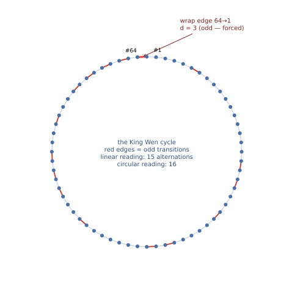

# [TR-7](TR7_CIRCULAR_READING.md) — The Circular Reading
*Technical report — not peer-reviewed. Every claim is machine-verifiable; see the Verification Guide.*

Methods, environment pinning, statistics conventions, and artifact access: see [METHODS.md](METHODS.md).

## Executive summary

What if the sequence is a circle — the last hexagram wrapping around to the first? Several scholars,
notably Terence McKenna, read it that way. This report re-derives the mathematics under the circular
reading. Two results stand out. First, the wrap-around step is **forced to be odd** (proved formally),
which makes McKenna's observed 3-to-1 ratio of even-to-odd transitions a necessity, not a choice.
Second, a surprise: the sequence's missing distance-5 transition is a **genuine extra rule** in the
circular reading — orderings that wrap at distance 5 make up 17.4% of the valid space, yet **not one**
appears among 10.5 billion enumerated records. That gap between the full space and the enumerated
slice is the sharpest demonstration in the project of why bounded search results need independent
measurement — and why we decided this rule, though real, stays documented rather than adopted.

## Abstract
McKenna & McKenna (1975) read the King Wen sequence as a *cycle* — position 64 wrapping to position 1 —
and their published counts (64 transitions, "three even integers to each odd integer") depend on that
closure. We work out exactly what the ROAE constraint system says under the circular reading. Three
theorems and one SAT decision result: (i) the wrap-around Hamming distance d(s₆₃, s₀) is odd for *every*
C4+C5-valid ordering — now machine-checked in Lean 4 at full generality (`wrap_parity_general`, structural
induction, not finite enumeration); (ii) McKenna's exact 3:1 even:odd transition ratio is a *forced
consequence* of C4 + C5 plus the XOR parity identity — a design feature he observed empirically that turns
out to be a theorem, not a choice; (iii) every valid circular reading has exactly 16 parity-class
alternations, and the first and last hexagrams of any valid linear ordering lie in opposite
popcount-parity classes. Finally, the circular form of C2 ("no 5-line transition anywhere on the cycle")
is a *genuine* extra constraint: valid linear orderings with a 5-line wrap exist (SAT-decided, explicit
witness) even though exactly zero appear among the 10,525,271,997 records of the deepest canonical slice;
the full-space wrap-distance masses are measured at d=1: 17.5%, d=3: 65.2%, d=5: 17.4% (2×10¹⁰
weighted-Knuth probes; CIs per METHODS.md's estimator convention). The operator's
documented decision: circular C2 is *not* promoted into the constraint system — the circular reading is
McKenna's interpretive frame, not an attested property of the received artifact.

## Sections
1. **The circular frame and its provenance.** McKenna & McKenna (1975, *The Invisible Landscape*, Part
   Two, Ch. 9) constructed their difference wave over 64 transitions *including* the wrap s₆₃ → s₀ (KW's
   wrap has Hamming distance 3) — the circular reading is theirs, with full attribution (CITATIONS.md,
   MCKENNA.md). What closure does *not* touch: C1, C3, C4 are position/pair properties, unaffected. What
   it touches: the transition multiset (C5) gains a 64th member, and C2 acquires a 64th application — the
   wrap itself.
2. **The wrap-parity theorem, three ways.** For any sequence satisfying C4 and C5, the wrap distance
   d(s₆₃, s₀) is odd — proven via the XOR parity identity (popcount(a⊕b) ≡ popcount(a)+popcount(b) mod 2).
   KW's wrap is d = 3. Verification stack: (a) the prose proof (SPECIFICATION.md); (b) the Lean 4
   kernel-checked general form `wrap_parity_general` — verified for EVERY C4+C5 sequence of 6-bit values by
   structural induction (telescoping transition-parity lemma + sum-parity/odd-count machinery), upgrading
   the formal core from "finite facts checked" to "sequence-level theorem proven"; (c) empirical
   corroboration at the d3 560T canonical (10,525,271,997 records, sha 9a968fa2…): 100.000000% odd wrap —
   necessarily, since `solve --verify` enforces the C4+C5 hypotheses; the theorem holds deductively, the
   enumeration validates the implementation.
3. **McKenna's 3:1 is forced, not designed.** His "perfect ratio of three to one" (16 odd of 64 circular
   transitions, 25.00% exact) is the circular reading of the wrap-parity theorem plus C5's 16-odd-of-64
   count. Every C4+C5-valid ordering has it. McKenna discovered the ratio empirically before its proof was
   articulated here — one of his most accurate quantitative claims, and stronger than he may have realized:
   forced by the constraint system, an artifact of no design choice at all.
4. **What closure changes: circular C5 and the 16-alternation corollary.** Under closure KW's transition
   multiset becomes {1:2, 2:20, **3:14**, 4:19, 6:9} (the d=3 count rises 13→14); orderings with d=1 wraps
   read {1:3, …, 3:13, …} instead. The parity-alternation theorem (PARITY_ALTERNATION.md; Lean
   `alternations_15_general`) forces exactly 15 alternations linearly; on the cycle the count must be even
   and the wrap boundary is forced to alternate (equivalent to wrap parity — two routes to one fact).
   **Corollary: every valid circular reading has exactly 16 alternations**, and the first and last
   hexagrams of any valid linear ordering lie in opposite popcount-parity classes (KW: 63 even → 42 odd ✓).
5. **Circular C2 is a genuine extra constraint — the SAT decision.** The wrap-parity theorem restricts the
   wrap to d ∈ {1, 3, 5}. At the 560T canonical the wrap is d=3 in 91.83% of records, d=1 in 8.17%, and
   d=5 in **exactly zero of 10,525,271,997**. Nevertheless, valid linear orderings with a 5-line wrap
   EXIST — SAT-decided (2026-07-03) with an explicit C1–C5-valid witness (final pair (32, 1); wrap
   d(1, 63) = 5; complement-distance sum 752). So the circular reading is *not* free: it excludes real
   members of the linear solution set. Per the twins lesson (SYMMETRY_SEARCH.md), budgeted-slice absence
   does not measure full-space rarity — and the full-space wrap-distance masses are now MEASURED (2×10¹⁰
   weighted-Knuth probes, 2026-07-03; CIs per METHODS.md's estimator convention; mass ratios are
   heavy-tail dominated — small probe budgets will not resolve them):
   **d=1: 17.5%, d=3: 65.2%, d=5: 17.4%**. The 5-wrap orderings that
   no budgeted slice has ever contained are between a fifth and a sixth of the full space; circular C2
   would cut the space by ×1.21.
6. **The non-promotion decision, on the record.** Operator decision 2026-07-03: circular C2 is documented,
   NOT promoted, and not implemented in solve.c in any form. Rationale (consistent with the R-series
   non-promotion discipline): the circular reading is McKenna's interpretive frame, not an attested
   property of the received artifact; enforcing it would add a reverse-engineered constraint. The
   implementation analysis, for the record: as a pure leaf-emission filter it would be byte-identical to
   the current lineage at every published canonical scale (zero 5-wrap records exist in any slice —
   divergence begins only in territory no budget has reached, as the SAT witness proves); as a prune it
   would change node consumption and open a new sha lineage. Neither is warranted. Closure also invites a
   larger symmetry question — without C4, a circular system would be invariant under the 32 pair-slot
   rotations as well as the B₃ relabelings — but under the actual system (C4 kept) the circular reading
   changes nothing about the symmetry group.

## Verification Guide
- Wrap-parity theorem, statement + proof: documentation/SPECIFICATION.md §Theorem (Wrap-around parity is
  odd)
- Lean general form: `lean lean/KingWen.lean` (Lean 4, tested 4.31.0; silence = all theorems check) —
  `wrap_parity_general`, supporting lemmas `transitions_sum_parity`, `sum_parity_odd_count`,
  `odd_count_partition`; see lean/README.md §Tier 2
- 560T wrap measurement (91.83% d3 / 8.17% d1 / zero d5): `./solve --verify-wrap-parity` against the d3
  560T canonical (sha registry: documentation/CANONICAL_HASHES.md). Note: this mode's printed theorem
  line formerly claimed "C2 forbids 5 → d ∈ {1,3}", contradicting §5's SAT result; corrected in public
  commit `0c24637` (2026-07-03) to state d ∈ {1,3,5} with d=5 not excluded by linear C2 (tabulator was
  always correct; stdout/comment only, selftest sha unchanged)
- Wrap-d5 witness: `python3 sat.py --witness wrap-d5` → the explicit 64-hexagram sequence in
  documentation/CIRCULAR_KING_WEN.md, C1–C5-valid, wrap d = 5
- Full-space wrap masses: `SOLVE_KNUTH_SCORE=1 ./solve --estimate-knuth 20000000000` (2×10¹⁰ probes,
  the budget behind the published 17.5/65.2/17.4% figures; 95% CIs per METHODS.md's Knuth-estimator
  convention — mass *ratios* are heavy-tail dominated, so small budgets (~10⁵ probes) will NOT
  reproduce them; this is an hours-scale run on many-core hardware. Method self-validation in
  documentation/SEARCH_SPACE_SIZE.md)
- 16-alternation corollary ingredients: documentation/PARITY_ALTERNATION.md + Lean
  `alternations_15_general`
- Non-promotion decision + rationale: documentation/CIRCULAR_KING_WEN.md §Status decision (operator,
  2026-07-03)
- Attribution: the circular reading is McKenna & McKenna (1975); the wrap-parity theorem, its 560T
  measurement, the alternation corollary, and the wrap-d5 SAT decision are ROAE (to our knowledge —
  corrections welcome via documentation/CITATIONS.md)

## Figure: the cycle

*The 64 hexagrams as a cycle in King Wen order (computed from the sequence itself). Red edges are odd
transitions; the highlighted wrap edge 64→1 jumps d = 3 — odd, as the wrap-parity theorem forces. The
circular reading has 16 odd transitions where the linear reading has 15: the wrap adds exactly one,
always.*

## Revision history
| Version | Date | Changes |
|---|---|---|
| v1.0 | 2026-07-04 | First public release |
| v1.1 | 2026-07-04 | Plain-language executive summary added; internal drafting TODOs resolved (figures kept as planned improvements) |
