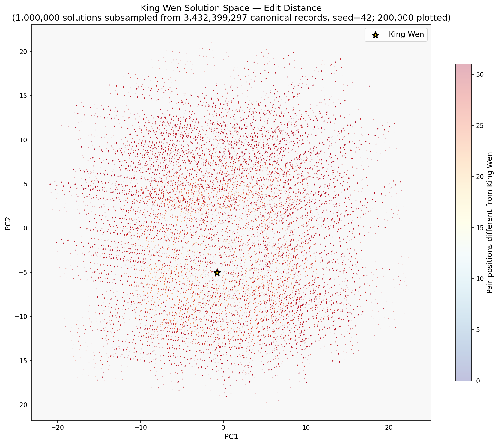
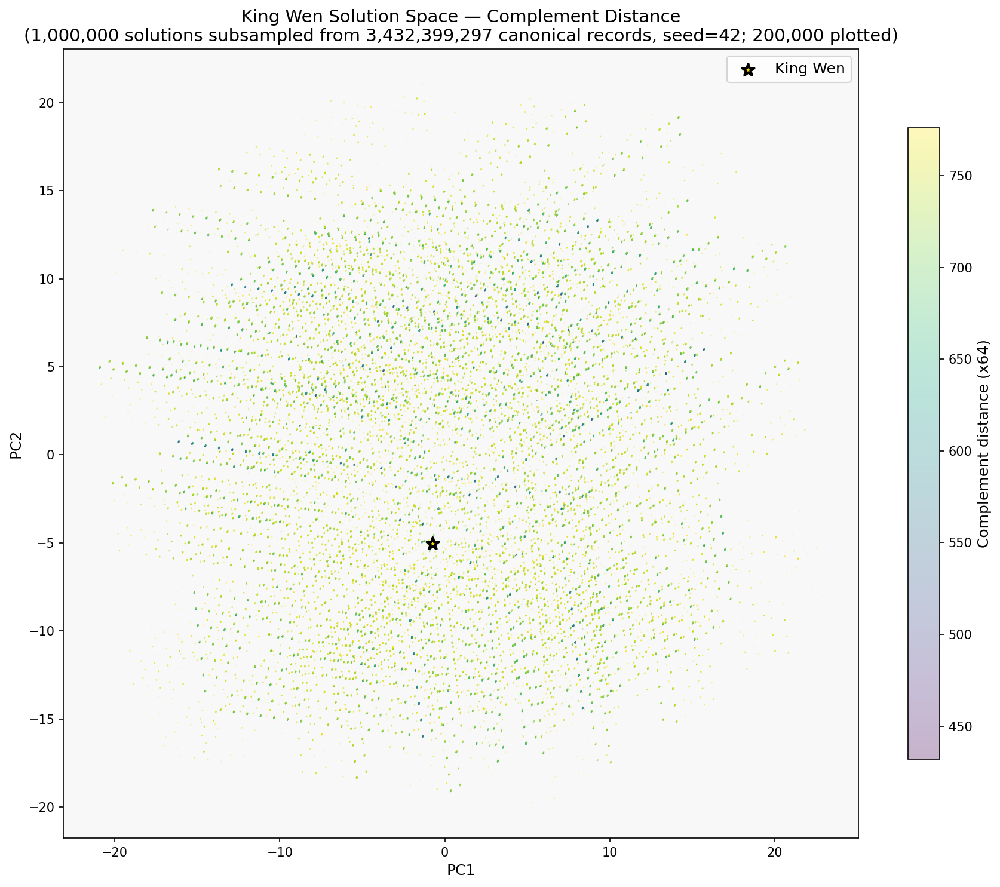
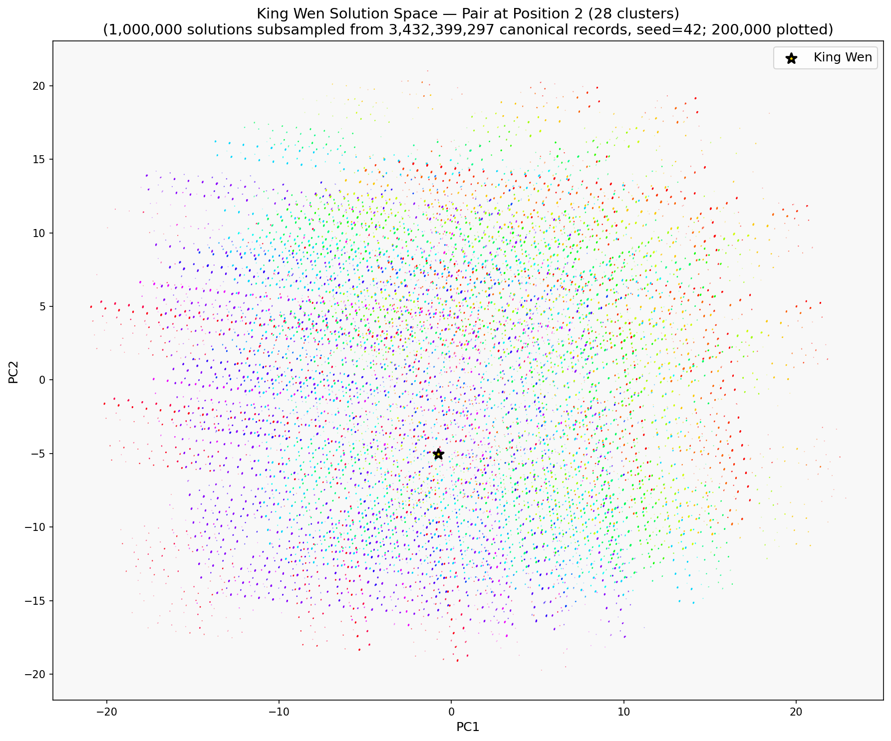
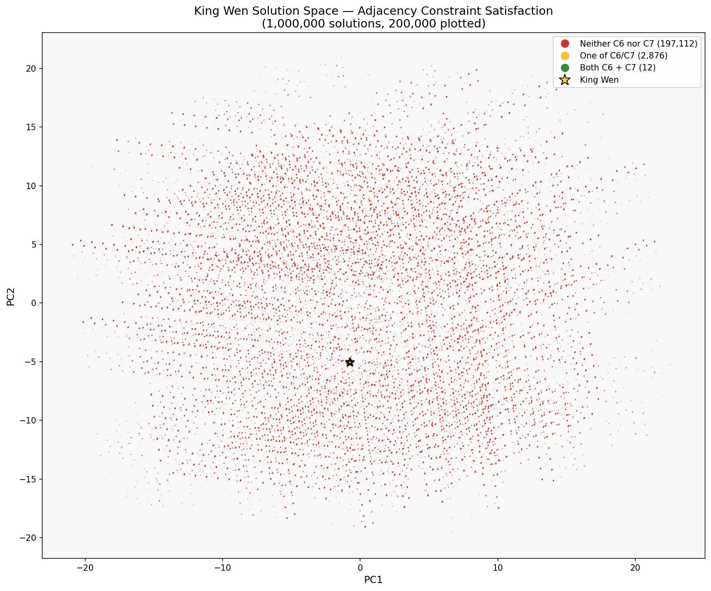

# Visualization — solution-space PCA plots

This directory contains:

- **`visualize.py`** — generator script that produces 2D PCA projections of a canonical `solutions.bin`, with four separate color schemes highlighting different properties.
- **`README.md`** (this file) — how to read and interpret the plots the script produces.

The plot output files themselves are archived per-run under `../solve_c/runs/<run-id>/viz/` — this directory holds the tooling, not the outputs.

## What you're looking at

Each valid King Wen sequence can be represented as a point in a
32-dimensional space: one coordinate per position in the sequence,
where the coordinate value is the **pair index** (0-31) placed at that
position. The full canonical dataset (hundreds of millions of records)
is a cloud of points in this 32-D space.

`visualize.py` applies **Principal Component Analysis (PCA)** to
reduce this 32-D cloud to a 2-D scatter plot. PCA finds the two
directions in 32-D that capture the largest variance in the data and
projects every solution onto those axes. The result: a 2-D picture
where points that are close in the plot tend to have similar
pair-placement patterns in the original 32-D space.

### How PCA axes relate to the underlying positions

The x-axis (PC1) and y-axis (PC2) are **not** positions in the
sequence — they are linear combinations of ALL 32 positions,
weighted by how much each position contributes to the overall
variance. Positions with lots of variance across the dataset
(e.g., positions 22-31 which are "progressively free") dominate
the axes; positions that are tightly constrained (e.g., position 1
which is locked, positions 3-19 which are in the "cascade") contribute
less.

In practice: **the PCA axes roughly track variance in the back-half
of the sequence** (positions 22-32), which is where the solution
space's variance lives.

### Subsampling note

Producing 200 million dots on a PNG would be an unreadable blob,
so the plotting step subsamples to at most 200,000 points (configurable
via `MAX_PLOT_POINTS` in `visualize.py`). **PCA itself uses all data**
— the axes are computed from the full 200M+ records, so the structure
is faithful. Only the visible dot density is subsampled.

King Wen itself is always included in the subsample (never dropped)
so you can find its location on each plot.

## The four plots

*Example images below are from the 100T d3 canonical run (sha `915abf30…`, 3.43B records). See [`solve_c/runs/20260419_100T_d3_d128westus3/viz/`](../solve_c/runs/20260419_100T_d3_d128westus3/viz/) for the full-resolution SVGs.*

### 1. `viz_edit_distance.png/.svg` — colored by edit distance to King Wen



**What's colored:** each solution's "edit distance" to King Wen,
defined as the number of positions where this solution's pair
differs from KW's pair. Range: 0 (only KW itself) to 32 (every
position differs).

**How to read it:**

- King Wen is the single dot with edit distance 0. Look for a
  darkest / outlier-colored point; the script highlights it.
- Neighbors (solutions at edit distance 1-2-3 from KW) cluster
  around it in the PCA projection. **Expect KW to NOT be isolated** —
  the constraint system creates structural similarity, so solutions
  very close to KW in edit distance usually sit near KW in PCA
  space too.
- Radial gradient (darker near KW, lighter far away) indicates PCA
  is capturing the "distance-from-KW" structure well.
- Distant colors scattered near KW = PCA axes don't align with KW's
  position in the space; that's information about how multi-modal
  the solution space is.

**What this implies:**

- **If KW is near the center of a dense cluster:** KW lives in a
  typical region of the solution space — its specific properties
  are shared with many other valid orderings. (Mechanically: PCA
  centers coordinates on the dataset mean, so "near (0,0)" means
  KW's back-half pair placements are close to the population
  *average* in the two highest-variance directions. Central does
  not mean distinguished — many other valid orderings also live
  there.)
- **If KW is at an edge or isolated:** KW is a statistical outlier
  among valid orderings.
- **Canonical d2 10T, d3 10T, and d3 100T all show KW sitting in a
  well-populated central region of PCA space**, not an isolated outlier.
  This is consistent with (a) CRITIQUE.md's note that KW's specific
  C4-C7 properties aren't distinguishing beyond the robust C1-C3
  findings, and (b) the d3 100T C3-ceiling result (KW ties ~340M
  other canonical orderings at C3=776; KW is the *mode* of the C3
  distribution, not the tail). Being typical in PCA space and
  typical at the C3 ceiling are two views of the same story in the
  *pair-placement* geometry: KW is not a geometric extremum there.
- **Important distinction: PCA centrality and the 2026-04-21 joint-density
  extremity (KW at 0.000%-ile, bootstrap 95% CI [0.000%, 0.000%] — see
  [`../DISTRIBUTIONAL_ANALYSIS.md`](../DISTRIBUTIONAL_ANALYSIS.md)) are NOT
  contradictory.** They are measurements in *different projection spaces*:
  - PCA here projects raw 32-byte ordering space (what pair is at each
    position) onto 2 or 3 dims — KW is central in that pair-placement space.
  - The distributional analysis projects orderings onto 7 informative
    *observable statistics* (c3_total, c6_c7_count, shift_conformant_count,
    first_position_deviation, fft_dominant_freq, fft_peak_amplitude,
    edit_dist_kw) and fits a KDE in that space — KW is extremal there
    because it simultaneously hits the 95th+ percentile on four
    independent structural observables.
  Being typical on raw position-of-each-pair does not imply being typical
  on derived structural statistics. Both views are correct.

### 2. `viz_complement_dist.png/.svg` — colored by complement distance (C3 value)



**What's colored:** each solution's total complement distance
(the sum of `|pos[v] - pos[v^63]|` across all 64 hexagrams).
Range: 424-776 on d3 10T (776 is KW's value — C3 enforces ≤ 776).

**How to read it:**

- Lower values (toward 424) = solutions where complementary
  hexagrams are placed closer together.
- Higher values (toward 776) = solutions where complements are
  placed farther apart.
- Color band structure: if the plot shows distinct bands of color,
  C3 correlates with one of the PCA axes (meaning complement
  distance is a dominant variance direction in the space).
- Uniform color scatter: C3 varies unpredictably with PCA axes
  (complement structure is orthogonal to dominant variance).

**What this implies:**

- **KW sits at the upper end of the range (776) because C3 enforces
  the ceiling**. The meaningful signal is that 100% of this dataset
  has C3 ≤ 776 — it's the filter, not an observation.
- The "3.9th percentile" claim for KW is against **all C1-C2-C4-C5
  orderings** (not within this C1-C5 dataset). Within this dataset
  KW is tautologically at 100th percentile.
- The distribution shape in this plot tells you HOW selective C3 is
  as a filter. A heavily skewed distribution (most points near 776,
  few near 424) means C3 is a strong filter that eliminates most
  pair-constrained sequences.

### 3. `viz_position2_cluster.png/.svg` — colored by which pair is at position 2



**What's colored:** the first-level branch identity. Position 2 is
the first "variable" position in the sequence (position 1 is locked
to KW's pair 0 by C4). The color is the pair index (0-31) placed
at position 2.

**How to read it:**

- If solutions cluster visibly by color, the PCA axes are picking
  up the first-level-branch structure — i.e., different position-2
  choices lead to different regions of the solution space.
- If colors are interleaved (mixed), the position-2 choice does not
  structurally constrain downstream positions in a way that dominates
  variance. The sequence's structure depends more on later choices.
- This plot essentially asks: **"Does the first-level-branch
  partition the solution space into visually distinct clusters?"**

**What this implies:**

- **Visible clusters by position-2 pair:** strong first-level-branch
  determinism. The branching structure in the search tree has real
  geometric consequences in the solution space.
- **Mixed colors:** the solution space has multiple independent
  degrees of freedom; first-level branch is one influence among many.
- This plot is the most direct visualization of the "56 first-level
  branches" partition structure that the enumerator is built around.

### 4. `viz_adjacency.png/.svg` — colored by C6/C7 adjacency satisfaction



**What's colored:** how many of the two "mandatory" KW-adjacency
constraints (C6 at positions 25-26, C7 at positions 27-28) this
solution satisfies. Values: 0 (neither), 1 (one), or 2 (both).

**How to read it:**

- Points with value 2 (satisfy both) are the closest candidates
  to KW structurally — they have KW's adjacencies at positions
  25-28.
- The previous analysis showed `{25, 27}` are mandatory in every
  working 4-subset for uniqueness. This plot visualizes how that
  constraint PARTITIONS the solution space: points colored "2"
  lie in the KW neighborhood; "0" solutions are far in some
  dimensions.

**What this implies:**

- **Spatial clustering of 2-colored points near KW:** confirms the
  geometric meaning of "mandatory boundaries 25/27". Satisfying them
  places the solution near KW even before checking other constraints.
- **2-colored points spread widely:** the boundary constraints are
  "orthogonal" to PCA variance — they're a filter, not a structural
  gradient.
- **Distribution of 0/1/2 across solutions** tells you the prior:
  what fraction of valid solutions already satisfy these
  adjacencies? If most are 0, {25, 27} are genuinely selective;
  if most are 2, they're essentially always satisfied.

## How to read all four together

The four plots share the same x-axis (PC1) and y-axis (PC2), so you
can overlay them mentally:

- **If position-2 clusters (plot 3) align with edit-distance contours
  (plot 1):** the first-level branch strongly determines distance-from-KW.
- **If complement-distance bands (plot 2) align with adjacency
  contours (plot 4):** the C3 structure and the C6/C7 structure are
  correlated (share variance directions).
- **Solutions that are 2-colored in plot 4 AND edit-distance 0-3 in
  plot 1:** the KW "neighborhood" — close in both metrics.
- **Solutions that are 0-colored in plot 4 but edit-distance < 10 in
  plot 1:** solutions that differ from KW by only a few positions
  but in exactly the positions that violate the mandatory adjacencies
  — these are the "hard to eliminate" non-KW survivors that the
  4-boundary structure targets.

## Limitations

1. **PCA is lossy.** Projecting 32 dimensions to 2 loses information.
   Two points close in the plot may be far apart in the original
   space (they just project to similar PC1/PC2 coordinates).
2. **Subsampling hides density.** 200,000 visible points cannot show
   regions with < 1 point per pixel. Dense regions look saturated;
   sparse regions look empty.
3. **Color scales are relative.** The plotted color gradient normalizes
   to the visible range in this dataset. A 100T plot and a 10T plot
   will have different absolute color scales even for the same
   property (e.g., "edit distance 15" may look different colors on
   each).
4. **PCA axes rotate per dataset.** If d2 and d3 10T produce different
   PC1/PC2 orientations, overlaying their plots directly doesn't work
   without re-projecting onto a common basis. Each plot's coordinate
   system is dataset-specific.
5. **PCA is linear.** Non-linear manifold structure (if any) is not
   captured. The plot shows the best 2-D linear projection; the
   actual solution manifold may curve in ways PCA flattens.

## Where the files live

- **Generator script**: `viz/visualize.py` (alongside this doc)
- **Per-run plot outputs**: `solve_c/runs/<run-id>/viz/` containing:
  - `viz_edit_distance.png` and `.svg`
  - `viz_complement_dist.png` and `.svg`
  - `viz_position2_cluster.png` and `.svg`
  - `viz_adjacency.png` and `.svg`

PNGs are raster (good for quick viewing). SVGs are vector (better
for zooming, publication, embedding in LaTeX). Choose per use case.

The per-run directory's `README.md` typically includes a brief
dataset-specific summary of what THAT run's plots show — clusters,
outliers, anomalies particular to the canonical sha being visualized.
This file (`viz/README.md`) is the stable how-to-read reference
applied across all runs.

## Regenerating from a fresh solutions.bin

```bash
pip install numpy matplotlib
# Run from the desired output directory so outputs land there:
cd solve_c/runs/<run-id>/viz/
python3 ../../../../viz/visualize.py /path/to/solutions.bin
```

Or from any location:

```bash
python3 viz/visualize.py /path/to/solutions.bin
```

Outputs land in the current working directory (4 PNG + 4 SVG, about
10-15 MB total per run). Requires matplotlib + numpy (not otherwise
dependencies of the project). Scales to 200M+ solutions in a few
minutes — PCA on the 32×32 covariance is nearly instant; the
bottleneck is reading solutions.bin from disk.
