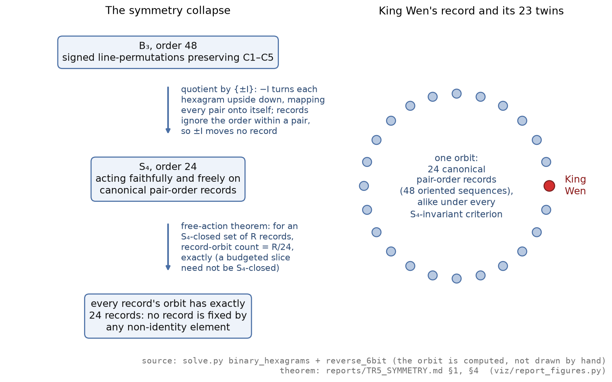
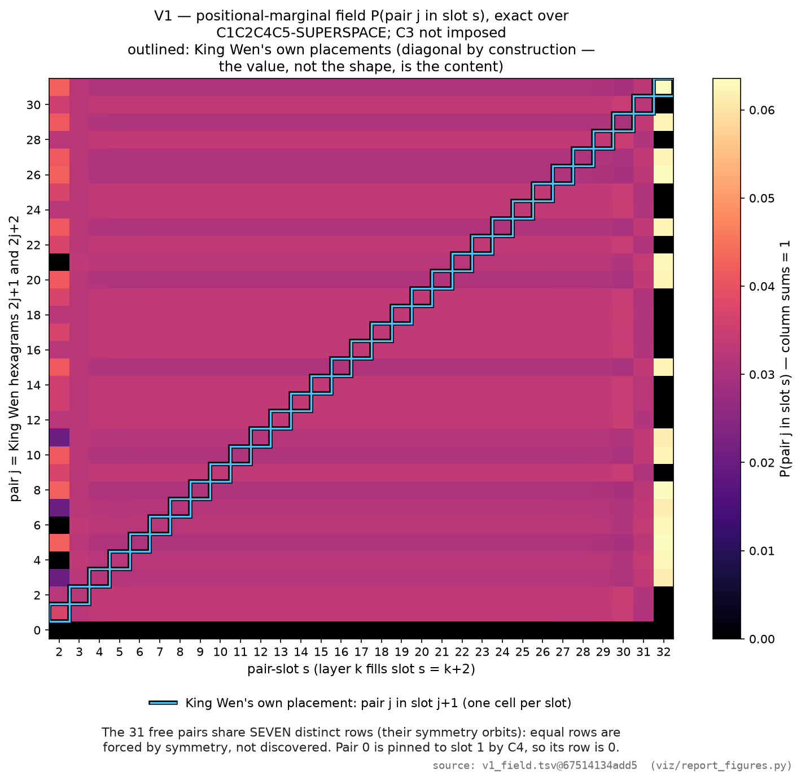
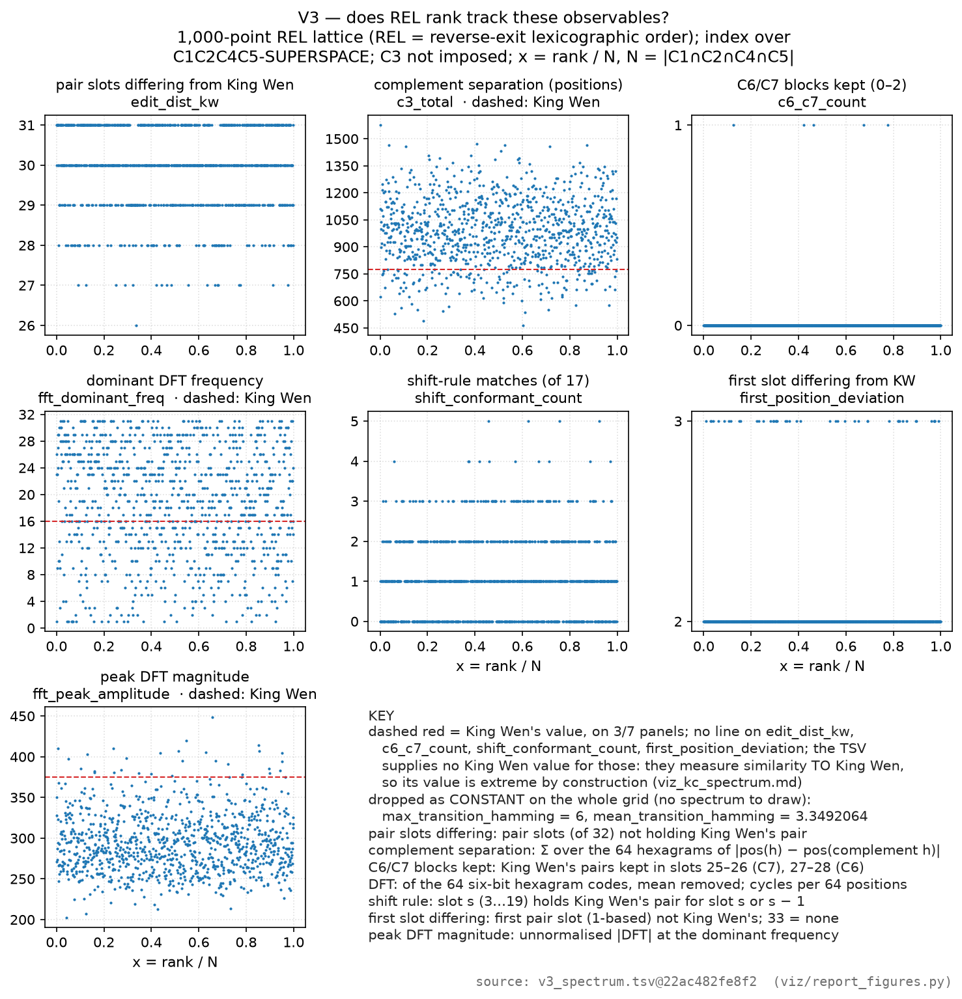
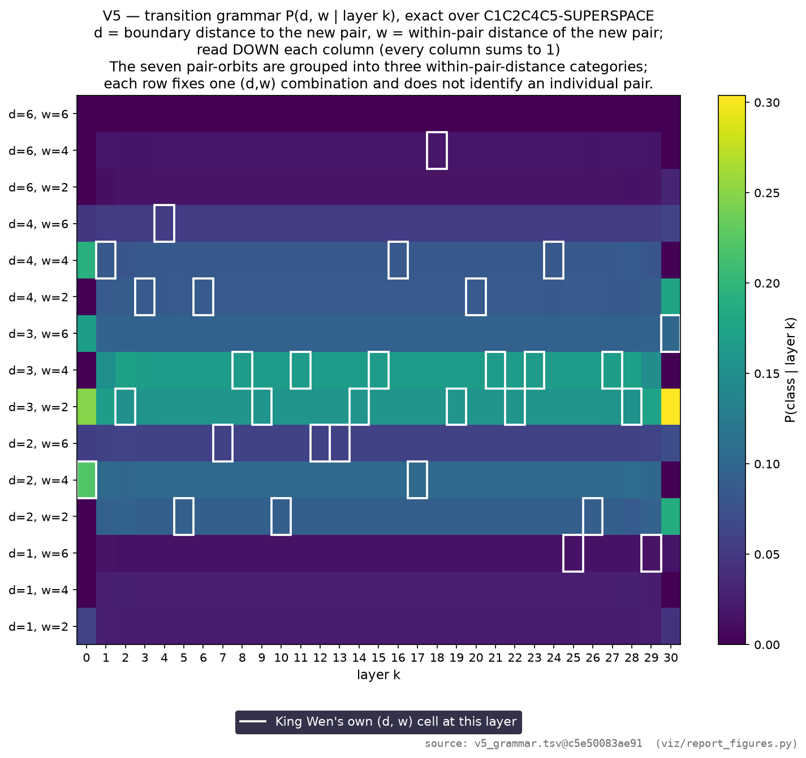
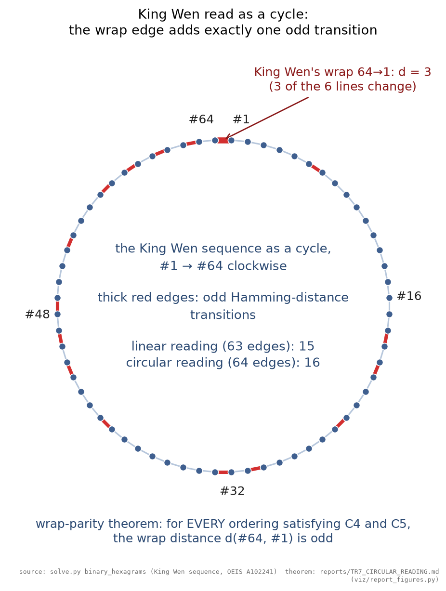

# Visualization — the visual capstone

ROAE is a mathematical analysis of the **King Wen sequence**, the received order of the 64 hexagrams
of the I Ching. It treats the order as a combinatorial object: it writes the sequence's proposed
structural rules down as constraints ([C1–C7](../README.md#the-constraints)), studies the space of
orderings that obey them, and asks which of the sequence's features that space forces and which it
does not. This page shows the twelve report figures the project publishes, grouped by the part of that
story each one tells.

**The project has two capstones.** The written one is
**[TR-12, The Query Program](../reports/TR12_QUERY_PROGRAM.md)**, the report that queries the
C1C2C4C5 superspace (every ordering satisfying C1, C2, C4 and C5; C3 is not imposed), exactly and
without listing it. The visual one is this page, which is TR-12's companion. Its
[TR-12 section](#king-wens-place-in-the-space-tr-12) follows TR-12's own order: the scale figure
from TR-12's scope section, then V1–V5 from [TR-12 §2](../reports/TR12_QUERY_PROGRAM.md#2-visualization-program-v1v5).
Every statement there about a TR-12 figure cites the TR-12 section it comes from, and says no more
than that section does. The other six figures come from the earlier reports, TR-1 to TR-7.

**What the figures show, taken together.** The space of valid orderings is far too large to list,
and even agreeing with King Wen at a few chosen boundaries is rare in it (TR-4). Its symmetries sort
valid records into groups of 24 that no test invariant under those symmetries can tell apart (TR-5). Four rules proposed for
the sequence in published studies cannot all hold at once in any ordering of the superspace, so
each such ordering, King Wen's included, trades some of them off (TR-1). Counted exactly over the superspace rather than sampled, King Wen's
pair positions sit close to the even share (V1, a negative result, TR-12 §12.5); the mix of
transition sizes stays nearly level along the walk (V2, TR-12 §2 and §12.6), with three-line joins
the most common kind at every step (V5, TR-12 §2); no plotted property shows a
clear trend along the index on a 1,000-point lattice (V3, TR-12 §2); and King Wen's own walk has an
exact rarity profile (V4, TR-12 §2). Some structure is forced on every valid ordering, King Wen's
included (TR-6, TR-7). And the enumerations behind the budgeted slices were run so that an interrupted
run still reproduces its result (TR-3). Each figure's page gives its full description, what it does
and does not establish, its provenance and its review history.

**How to use this page.** Each figure is shown as a PNG; click it for the SVG. Under each is its
**In plain terms** summary, written for a general reader and never stronger than the report section it
cites, then a link to the figure's own page and to its report. The report section carries the
authoritative caption. [Reference](#reference) at the end holds the index tables, the reproduction
recipe and the historical material.

## The space and its scale

The rules define a space of orderings, and the first question is how large it is and how it is
organised. TR-4 estimates how quickly the space narrows when an ordering must agree with King Wen at
chosen boundaries. TR-5 finds the symmetries of the rules and shows they sort the space into groups
of 24 records. The exact count of the superspace, set beside the enumerated slices, is the scale
figure in the [TR-12 section](#the-scale-figure) below.

### TR-4 — the boundary-information curve S(k)

[](../reports/figures/fig_tr4_boundary_information.svg)

**In plain terms.** This curve shows how quickly the share of valid orderings falls when an ordering must match King Wen
at more and more chosen joins between pairs. The four red points are estimates, each within about ten
percent, and each of these first joins cuts the share by roughly a thousand times. The dashed line and
the shaded bracket are illustrations, not measurements, and the vertical line is a marker of scale,
not a limit. Even with every join matched, many orderings still remain, because matching joins fixes
which pairs go where but not which way round each pair is placed.

Full description, provenance and review history: [viz_tr4_boundary_information.md](viz_tr4_boundary_information.md) · Report: [TR-4 §Figure](../reports/TR4_SIZE_OF_THE_SPACE.md#figure)

### TR-5 — the symmetry collapse

[](../reports/figures/fig_tr5_orbit_collapse.svg)

**In plain terms.** There are 48 ways to reshuffle and flip the six lines of every hexagram at once that keep the
project's rules true. One of them, turning every hexagram upside down, changes nothing in a record (a
record lists the order of the 32 pairs, not which member of each pair comes first), so only 24
different changes are left. The picture shows that these 24 turn King Wen's record into 24 different
records, and TR-5 proves the same holds for every valid record. Any test that gives the same answer
under these 24 changes cannot tell such a group of records apart.

Full description, provenance and review history: [viz_tr5_orbit_collapse.md](viz_tr5_orbit_collapse.md) · Report: [TR-5 §Figure: the symmetry collapse](../reports/TR5_SYMMETRY.md#figure-the-symmetry-collapse)

## The rules and the conflict

Commentators have proposed rules that the sequence is supposed to follow. The project measures them
against the space and, where it can, decides them exactly. The sharpest result is a conflict: four of
the strongest rules cannot all hold together in any ordering of the superspace, which TR-1 and TR-2
show with a drat-trim-verified SAT certificate.

### TR-1 — the conflict theorem's trade-off

[](../reports/figures/fig_tr1_rules_tradeoff.svg)

**In plain terms.** This table compares King Wen's order with the "grand unified precursor", an ordering that differs
from King Wen in three places, on four rules taken from published studies of the sequence. King Wen
misses each of the first three rules by two and keeps the fourth exactly, while the precursor keeps
the first three perfectly and breaks the fourth. A computer-checked proof shows that no ordering
obeying four of the project's five core rules (all but the one called C3) can keep all four of these
rules at once, so some trade-off is forced.

Full description, provenance and review history: [viz_tr1_rules_tradeoff.md](viz_tr1_rules_tradeoff.md) · Report: [TR-1 §Figure](../reports/TR1_EIGHT_CENTURIES_MEASURED.md#figure), also in [TR-2 §Figure](../reports/TR2_THE_RULES_CONFLICT.md#figure)

## King Wen's place in the space (TR-12)

This section is the visual half of the capstone and follows
[TR-12](../reports/TR12_QUERY_PROGRAM.md) in its own order. [TR-11](../reports/TR11_EXACT_COUNTING_BY_SYMMETRY_QUOTIENT.md)
counted the superspace exactly, and TR-12 queries it without listing it, through compiled
f, g and t ladders (TR-12 §R).

**The space.** V1–V5 draw on the compiled walk superspace, **SUPERSPACE** = C1 ∧ C2 ∧ C4 ∧ C5: every
constraint except C3, i.e. the space [TR-4](../reports/TR4_SIZE_OF_THE_SPACE.md) sizes, taken *before*
C3 is applied. Its exact cardinality `N` is whatever `solve --kc-count` reports. Every caption carries
the label `C1C2C4C5-SUPERSPACE; C3 not imposed`. The five figures do not all plot the same kind of
quantity: V1, V2 and V5 plot population quantities over C1C2C4C5-SUPERSPACE. V4 follows King Wen's
single oriented walk; V3 evaluates a systematic 1,000-point REL lattice.

### The scale figure

*From [TR-12 §"What this document is, and what it is not"](../reports/TR12_QUERY_PROGRAM.md#what-this-document-is-and-what-it-is-not): why the program queries a compiled space rather than an enumerated one.*

[](../reports/figures/viz_scale.svg)

**In plain terms.** This picture puts two different counts on one scale. The three red points are how many orderings three
of the project's large computer searches recorded; each search explored only a budgeted slice of the
possibilities, so each count is a lower bound. The line near the top is the exact size of a larger
space, computed by a counting method rather than by listing, which leaves out one rule (the one called
C3). The two count different spaces in different units, so the gap of about 29 powers of ten is a
distance between the plotted numbers, not a measure of how much the searches missed; what it does show
is that, if the trend of the three searches continues, a bigger search budget is not a way to reach
the whole space.

Full description, provenance and review history: [viz_scale.md](viz_scale.md) · Report: [TR-12 §"What this document is, and what it is not"](../reports/TR12_QUERY_PROGRAM.md#what-this-document-is-and-what-it-is-not)

### V1 — the positional-marginal field

*From [TR-12 §2](../reports/TR12_QUERY_PROGRAM.md#2-visualization-program-v1v5); its reading is [§12.5](../reports/TR12_QUERY_PROGRAM.md#125-the-positional-pair-field-is-flat-to-about-3---the-reading-of-v1-and-it-is-negative). C1C2C4C5-SUPERSPACE; C3 not imposed.*

[](../reports/figures/fig_tr12_kc_field.svg)

**In plain terms.** This grid has one row for each of the 32 pairs of hexagrams and one column for each place in the
sequence where a pair can go. Each square's shade is the exact share of all allowed orderings that
put that pair in that place, where "allowed" means obeying four of the project's five core rules
(every rule except the one called C3), a 40-digit number of orderings. Away from the two ends the
shades are close to even, and King Wen's own placements (outlined) carry close to the even share.
TR-12 reports this as a negative result: where a pair sits, taken one place at a time, says almost
nothing about whether an ordering is allowed (§12.5).

Full description, provenance and review history: [viz_kc_field.md](viz_kc_field.md) · Report: [TR-12 §2](../reports/TR12_QUERY_PROGRAM.md#2-visualization-program-v1v5)

### V2 — the mass river and the branch panel

*From [TR-12 §2](../reports/TR12_QUERY_PROGRAM.md#2-visualization-program-v1v5); the budget it draws is §12.1, and the level shares are §12.6. C1C2C4C5-SUPERSPACE; C3 not imposed. The reduced form: split by distance class, not by top-level branch class.*

[](../reports/figures/fig_tr12_kc_river.svg)

**In plain terms.** This picture follows every allowed ordering at once as the sequence is built, one pair at a time.
The top panel shows, at each step, what share of orderings make each size of jump into the next
pair, where a jump's size is how many of the six lines change; the shares stay nearly level from
start to finish, and a black line traces King Wen's own jump at each step. The bottom panel splits
the orderings by their first free choice, 56 possibilities, and shows that a bigger group always
costs at least as much to search in full as a smaller one. "Allowed" here means obeying four of the
five core rules (all but the one called C3).

Full description, provenance and review history: [viz_kc_river.md](viz_kc_river.md) · Report: [TR-12 §2](../reports/TR12_QUERY_PROGRAM.md#2-visualization-program-v1v5)

### V3 — the rank spectrum

*From [TR-12 §2](../reports/TR12_QUERY_PROGRAM.md#2-visualization-program-v1v5). C1C2C4C5-SUPERSPACE; C3 not imposed. A 1,000-point REL lattice, not a sample of the space.*

[](../reports/figures/fig_tr12_kc_spectrum.svg)

**In plain terms.** Every allowed ordering (one that obeys four of the five core rules, all but the one called C3) has
a numbered place in one fixed list. This picture checks 1,000 evenly spaced places in that list and
asks whether seven measured properties of an ordering rise or fall as you move down it. None shows a
clear trend, so at these 1,000 points the place in the list does not track these properties. That
does not rule out more complicated patterns, or patterns that fall between the points.

Full description, provenance and review history: [viz_kc_spectrum.md](viz_kc_spectrum.md) · Report: [TR-12 §2](../reports/TR12_QUERY_PROGRAM.md#2-visualization-program-v1v5)

### V4 — King Wen's neighbourhood shells

*From [TR-12 §2](../reports/TR12_QUERY_PROGRAM.md#2-visualization-program-v1v5), drawing TR-12's [Q3](../reports/TR12_QUERY_PROGRAM.md#q3-kws-rarity-profile--fg-at-each-of-kws-31-prefix-steps) rarity profile. C1C2C4C5-SUPERSPACE; C3 not imposed. One walk, King Wen's, not a population; the shaded bars are attested.*

[](../reports/figures/fig_tr12_kc_shells.svg)

**In plain terms.** This picture follows only King Wen's own ordering, not the whole population. After each of its 31
free choices, the top panel shows how many allowed orderings (those obeying four of the five core
rules, all but the one called C3) still begin the same way, a count that falls from a 38-digit number
to exactly one; the shaded bars show the range for the other choices that were open at that step. The
bottom panel shows how surprising each of King Wen's choices is, measured in bits, where one bit is
the surprise of a fair coin toss.

Full description, provenance and review history: [viz_kc_shells.md](viz_kc_shells.md) · Report: [TR-12 §2](../reports/TR12_QUERY_PROGRAM.md#2-visualization-program-v1v5)

### V5 — the transition grammar

*From [TR-12 §2](../reports/TR12_QUERY_PROGRAM.md#2-visualization-program-v1v5); the largest class is §12.1's. C1C2C4C5-SUPERSPACE; C3 not imposed.*

[](../reports/figures/fig_tr12_kc_grammar.svg)

**In plain terms.** At each step of building an ordering, this picture shows the exact odds of each kind of next move,
taken over every allowed ordering at once (those obeying four of the five core rules, all but the one
called C3). A kind of move is described by two counts: how many of the six lines change across the
join into the new pair, and how many lines differ between the new pair's own two hexagrams. Joins
that change three lines are the most common at every step, and King Wen's own move is outlined at each
step. Each column is an average over all orderings; it is not the odds given King Wen's earlier moves.

Full description, provenance and review history: [viz_kc_grammar.md](viz_kc_grammar.md) · Report: [TR-12 §2](../reports/TR12_QUERY_PROGRAM.md#2-visualization-program-v1v5)

TR-12's other results, among them the doomed-prefix share, King Wen's per-step percentile and the two
external anchors, are stated in [TR-12 §12](../reports/TR12_QUERY_PROGRAM.md#12-what-the-n31-atlas-establishes--measured-from-the-atlas-alone-2026-09-21)
without a figure of their own.

## Structure of the sequence

Some properties of King Wen's order turn out to be forced: every ordering that obeys the rules has
them. TR-6 proves a count of parity changes along the sequence, and TR-7 proves what happens when the
sequence is read as a circle. Both figures are computed from the sequence itself.

### TR-6 — King Wen's parity-class string

[](../reports/figures/fig_tr6_parity_alternations.svg)

**In plain terms.** Every hexagram is "even" or "odd", depending on whether it has an even or odd number of solid lines,
and the two hexagrams of each pair always agree. This strip shows King Wen's 32 pairs in order, each
marked even or odd: there are exactly 16 of each, and the type switches exactly 15 times along the
sequence. TR-6 proves that every ordering obeying all five core rules has exactly those 15 switches,
so this count is forced by the rules and is not special to King Wen.

Full description, provenance and review history: [viz_tr6_parity_alternations.md](viz_tr6_parity_alternations.md) · Report: [TR-6 §Figure](../reports/TR6_PARITY_SKELETON.md#figure)

### TR-7 — the cycle

[](../reports/figures/fig_tr7_circular_cycle.svg)

**In plain terms.** This ring places all 64 hexagrams in King Wen order and joins the last one back to the first. Red
edges mark the steps where an odd number of the six lines change: 15 along the sequence, plus the step
from hexagram 64 back to hexagram 1, which changes three lines. TR-7 proves that this closing step
changes an odd number of lines in every ordering that obeys two of the core rules (C4 and C5), so for
orderings that obey all five, reading the sequence as a circle always adds exactly one odd step.

Full description, provenance and review history: [viz_tr7_circular_cycle.md](viz_tr7_circular_cycle.md) · Report: [TR-7 §Figure: the cycle](../reports/TR7_CIRCULAR_READING.md#figure-the-cycle)

## How the computation was run

The enumerated slices that the scale figure plots came from long, interruptible cloud runs. TR-3 is
about running them so that a run that is stopped and resumed still reproduces its result byte for
byte.

### TR-3 — the first 560T campaign's timeline

[](../reports/figures/fig_tr3_campaign_timeline.svg)

**In plain terms.** This timeline shows the first run of the project's deepest search, from 31 May to 8 June 2026, on
rented cloud machines that the provider may take back at short notice (an "eviction"). On each
weekday morning the machine was taken back (red marks), and the run waited until the evening to
restart (purple blocks). Over the weekend there were no interruptions, and the run finished. The
picture records how the search was run; it is not a mathematical result.

Full description, provenance and review history: [viz_tr3_campaign_timeline.md](viz_tr3_campaign_timeline.md) · Report: [TR-3 §Figure](../reports/TR3_REPRODUCIBLE_ENUMERATION.md#figure)

## How these figures are made and checked

- **One committed generator.** All twelve figures are drawn by [`report_figures.py`](report_figures.py).
  Each number a figure draws is read from a committed table, whose sha256 prefix the figure prints in
  its footer (V1–V5 and the scale figure); or typed from the report it illustrates with a source
  comment and asserted before drawing (TR-1, TR-3, TR-4); or computed from `solve.py`'s King Wen
  sequence (TR-5, TR-6, TR-7). The V1–V5 renderers read tables and do no analysis.
- **Byte-identical re-render.** Under the pinned toolchain, matplotlib 3.11.0 and numpy 2.4.4, the
  documented command reproduced all twelve committed PNGs byte for byte on 2026-09-29 (CX-233), as it
  did when the set was last redrawn. SVGs are compared line-wise; see
  [Reproduce the figures](#reproduce-the-figures).
- **Checks in the generator.** The generator refuses to write a figure with any glyph below 12 px at a
  900-px display, asserts text contrast before drawing, and refuses a V table that is not the complete
  grid its spec names (`FIGURE_SHAPE=FAIL`); `bash scripts/doc_gates.sh viz-shape` shows those guards
  can fail.
- **Outside review.** The figures were reviewed twice by Codex: the figure review VIZ1 (2026-09-26)
  and the visualization review of 2026-09-27 and 2026-09-28. Fable checked or triaged every finding
  against the committed files before anything changed. The redraws and corrections are recorded in
  [CORRECTIONS.md](../documentation/CORRECTIONS.md), entries CX-191, CX-192, CX-204, CX-205 and
  CX-224 to CX-228; each figure's page lists the entries that touched it.
- **Stated limits.** Each spec page has a "What it may NOT claim" section, and each figure page says
  what its figure does not establish.

## Earlier visualizations

*Historical. These figures describe the enumerated slices, chiefly the d3 560T canonical, and were
made before the compiled superspace became the project's centre. They are kept because published
documents cite them; nothing in them is current guidance.*

- [archive/](archive/README.md): the four PCA projections of the 560T canonical
  ([viz_pca.md](archive/viz_pca.md)), the growth curve and the re-run telemetry panels
  ([viz_graphs.md](archive/viz_graphs.md)), and the held narrative figures' spec
  ([viz_narrative.md](archive/viz_narrative.md)).
- [The 560T re-run's telemetry page](../runs/20260608_560T_9a968fa2/viz/index.html), archived with
  its run.
- The tools that made them, and the commands, are under
  [Historical material](#historical-material-the-enumerated-slice-figures) below.

## Reference

### The TR-12 figures

| Figure | What it shows | Committed input (footer `name@sha256[:12]`) | Spec |
|---|---|---|---|
| [`fig_tr12_kc_field`](../reports/figures/fig_tr12_kc_field.svg) — V1 | 32×31 heat matrix: the exact fraction of the superspace placing each pair in each slot, King Wen overlaid | `reports/tr12/scan/v1_field.tsv@67514134add5` | [viz_kc_field.md](viz_kc_field.md) |
| [`fig_tr12_kc_river`](../reports/figures/fig_tr12_kc_river.svg) — V2 | how the superspace's mass redistributes across the 31 placements by transition distance class, with the exact per-branch panel; the REDUCED form (split by distance class, not by top-level branch class) | `reports/tr12/scan/v2_river.tsv@380111eb002e`, `reports/tr12/scan/v2_branches.tsv@3d75e6d619ba` | [viz_kc_river.md](viz_kc_river.md) |
| [`fig_tr12_kc_grammar`](../reports/figures/fig_tr12_kc_grammar.svg) — V5 | the exact conditional law of the next move at every layer, by distance class d and within-pair distance w | `reports/tr12/scan/v5_grammar.tsv@c5e50083ae91` | [viz_kc_grammar.md](viz_kc_grammar.md) |
| [`fig_tr12_kc_shells`](../reports/figures/fig_tr12_kc_shells.svg) — V4 | King Wen's neighbourhood shells: how the space collapses onto one ordering along King Wen's walk; the line is one walk, not a population, and the shaded bars are the attested range over the admissible alternatives | `reports/tr12/q3_profile_kw.tsv@bbe62f3bc6a3`, and for the attested alternatives band `reports/evidence/tr12/banked_n31_20260922/q3_profile_exact.tsv@ee0b99fde78a` | [viz_kc_shells.md](viz_kc_shells.md) |
| [`fig_tr12_kc_spectrum`](../reports/figures/fig_tr12_kc_spectrum.svg) — V3 | the rank spectrum: whether the REL rank index (not the citable O3 order) orders the space by any of the plotted observables (seven panels), on a 1,000-point lattice | `reports/tr12/v3_spectrum.tsv@22ac482fe8f2` | [viz_kc_spectrum.md](viz_kc_spectrum.md) |
| [`viz_scale`](../reports/figures/viz_scale.svg) | budgeted slices and the compiled superspace on one axis; the two series count different spaces | `viz/viz_scale_inputs.tsv@fcd28d197a17`, each row asserted against [CANONICAL_HASHES.md](../documentation/CANONICAL_HASHES.md), and N against [METHODS.md](../reports/METHODS.md) | [viz_scale.md](viz_scale.md) |

The five V figures are embedded in [TR-12 §2](../reports/TR12_QUERY_PROGRAM.md#2-visualization-program-v1v5),
which carries their full captions and is the authority; the scale figure is embedded in
[TR-12 §"What this document is, and what it is not"](../reports/TR12_QUERY_PROGRAM.md#what-this-document-is-and-what-it-is-not).
All six are also shown, with short captions, in the landing [README §Figures](../README.md#figures), in the [TR-12 section](#king-wens-place-in-the-space-tr-12) above and at the top of each spec page.
V3's status token: the standalone n=31 V3 rows passed on 2026-09-25 (`TR12_V3_FIG=PASS`,
[evidence](../reports/evidence/tr12/v3_rows_n31_20260925/README.md)); the archived 2026-09-22 full-run
receipt retains its original `PENDING` token.

Each spec page fixes the figure's job, its caption rules and what it may not claim, and carries its
own drafting record and Status table.

### Reproduce the figures

```bash
python3 -m pip install "numpy==2.4.4" "matplotlib==3.11.0"   # external; not dependencies of roae.py / solve.c
cd reports/figures && python3 ../../viz/report_figures.py
```

The artifact root defaults to the repository's own `reports/tr12/`, resolved from the generator's location,
not from the working directory; pass another root as the first argument. Figures are written to the
working directory, so run from `reports/figures/` to overwrite the committed files in place and
`git diff --stat` to compare. A V figure whose table is absent is skipped with a message.

- **PNG byte-identity requires matplotlib 3.11.0.** Measured 2026-09-27 with matplotlib 3.11.0 and
  numpy 2.4.4: all ten generated PNGs came back byte-identical to the committed ones (twelve of twelve once TR-5 and TR-7 had renderers, Q-858). The same run
  under matplotlib 3.6.3 matched none of the ten (CX-192 in
  [CORRECTIONS.md](../documentation/CORRECTIONS.md)). The committed SVGs record the version in their
  metadata (`Matplotlib v3.11.0`); two renders of the same SVG differ only in `<dc:date>` and element
  ids, so compare SVGs line-wise, never byte-wise.
- **The twelve generated figures** are the six above plus `fig_tr1_rules_tradeoff`,
  `fig_tr3_campaign_timeline`, `fig_tr4_boundary_information`, `fig_tr5_orbit_collapse`,
  `fig_tr6_parity_alternations` and `fig_tr7_circular_cycle` (TR-5's and TR-7's are computed from the
  King Wen sequence in `solve.py` and read no table). The two held narrative figures specified in
  [archive/viz_narrative.md](archive/viz_narrative.md) are not committed; any such file a run leaves
  in the output directory is not part of the comparison.
- **Text floor.** `save()` measures the SVG it is about to write and refuses to write either file if
  any glyph would render below 12 px when the figure's full width is shown at 900 px, the width of a
  rendered Markdown column. That means every placed glyph, nested mathtext included: a superscript's own scale is composed with its text group's, so a `10^n` tick label's 0.7-scaled exponent is measured at its real size (Q-889, 2026-09-28; until then only the outer scale was read, and TR-4 and the scale figure shipped 46 exponent glyphs at 8.8–8.9 px). **Contrast.** Text a renderer sets on a known background is asserted at 4.5:1 or better (WCAG 2) before anything is drawn, and King Wen's outline on V1 and V5 is two-tone — a light core over a black under-stroke — so on any cell one of the two contrasts by at least 3:1 (Q-899/Q-900, 2026-09-28; V2's band labels were set in their band colour at 2.2–2.4:1 on white, TR-6's white O on orange at 2.16:1).
- **Provenance footer.** Every TR-12 figure carries `source: <table>@<sha256[:12]>` in its bottom
  margin, one entry per input, ending `(viz/report_figures.py)`. It has no timestamp, so the same
  table gives the same PNG under the recorded environment (matplotlib 3.11.0, numpy 2.4.4, DejaVu Sans; Q-901) — table identity alone does not fix the pixels. To check a figure against a table, compare the footer with the first 12
  hex of `sha256sum` of that table; a missing input prints as `<name>@ABSENT`. The digest is of the bytes the figure parsed: each table is read once and the parse and the digest come from that one read (Q-890, 2026-09-28). The scale figure's budgets, record counts, sha prefixes and N are the committed table `viz/viz_scale_inputs.tsv`, each row asserted against `documentation/CANONICAL_HASHES.md` (N against `reports/METHODS.md`) at render time, and its footer carries that table's digest.
- **Shape guards.** A table that is present but incomplete is refused, not drawn: each V figure
  checks that its table is a complete, duplicate-free, contiguous grid over the index columns its
  spec names, with the header's field count on every row (a blank or whitespace-only row is refused) and every column its spec lists present, and that the grid is the spec's own inventory rather than whatever the rows happen to span (Q-892, 2026-09-28): layers `k = 0…n−1`, all 32 pair rows, classes `d ∈ {1,2,3,4,6}` (× `w ∈ {2,4,6}` for V5), V4 steps `1…n` ending at `g = 1`, V3 rows `i = 0…K−1` with `rank = i·⌊N/K⌋` and `x = rank/N`. `n` comes from the Q3 table's sidecar or step count when `tr12_figures` runs; a figure rendered on its own without `n` still requires the lowest layer, and only the highest one then rests on the footer digest. A
  violation prints `FIGURE_SHAPE=FAIL` with the file, the line and the reason, and writes no figure.
  V3 also drops constant observable columns (constancy decided on the parsed numbers) and names them; a V3 table that is present and refused fails the run, and only an absent one is skipped (Q-893). V4 names a receipt it was given and could not find as `q3_profile_exact.tsv@ABSENT` in its footer, and uses King Wen's name in its titles only for a table that is King Wen's walk (Q-891). V2 at `n = 31` requires its branch table, whose `prefixes_t_units` must be all integers (drawn) or all `PENDING_T_LADDER(...)` (stated on the panel as unavailable); anything else is refused (Q-894). `bash scripts/doc_gates.sh viz-shape`
  runs `python3 viz/report_figures.py --selftest` and requires `VIZ_SHAPE_SELFTEST=PASS`.

### How the tables are produced

The V1–V5 renderers are **TSV-to-figure**: they read the committed tables and perform no analysis. The other figures draw from cited report constants (TR-1, TR-3, TR-4; the scale figure fits its three-point power law from CANONICAL_HASHES.md constants) or from the King Wen sequence itself (TR-5, TR-6, TR-7).
V1, V2 and V5's tables are written by the atlas consumer, `python3 solve.py --atlas-queries ATLAS.json
--atlas-out DIR` (from the published n=31 atlas, `runs/20260906_kc_ladders_n31/`); V4's needs
`--atlas-q3-trace TRACE` on the same call; V3's is the separate join `solve.py --v3-spectrum GRID OUT`.
Both are documented in [SOLVE_PY_CLI.md](../documentation/SOLVE_PY_CLI.md); the atlas consumer is
gated at n=9 by `--atlas-selftest` → `ATLAS_CONSUMER=PASS`.

### Every committed figure, and where it is shown

This table lists every committed figure image and the pages that show or link it, so that none is
orphaned; each report figure is also shown in its section of this page and on its own figure page. Captions live on the linked pages; this is an index. The landing
[README](../README.md#figures) shows the report figures in its §Figures.

| Figure (PNG + SVG unless noted) | What it is | Shown in |
|---|---|---|
| [`fig_tr12_kc_field`](../reports/figures/fig_tr12_kc_field.svg) | V1, positional-marginal field (C1C2C4C5-SUPERSPACE) | [TR-12 §2](../reports/TR12_QUERY_PROGRAM.md#2-visualization-program-v1v5), [viz_kc_field.md](viz_kc_field.md), and [above](#v1--the-positional-marginal-field) |
| [`fig_tr12_kc_river`](../reports/figures/fig_tr12_kc_river.svg) | V2, mass river and branch panel; the REDUCED form (C1C2C4C5-SUPERSPACE) | [TR-12 §2](../reports/TR12_QUERY_PROGRAM.md#2-visualization-program-v1v5), [viz_kc_river.md](viz_kc_river.md), and [above](#v2--the-mass-river-and-the-branch-panel) |
| [`fig_tr12_kc_spectrum`](../reports/figures/fig_tr12_kc_spectrum.svg) | V3, rank spectrum; the standalone n=31 V3 rows passed on 2026-09-25 (`TR12_V3_FIG=PASS`), and the archived 2026-09-22 full-run receipt retains its original PENDING token (C1C2C4C5-SUPERSPACE) | [TR-12 §2](../reports/TR12_QUERY_PROGRAM.md#2-visualization-program-v1v5), [viz_kc_spectrum.md](viz_kc_spectrum.md), and [above](#v3--the-rank-spectrum) |
| [`fig_tr12_kc_shells`](../reports/figures/fig_tr12_kc_shells.svg) | V4, King Wen's neighbourhood shells; the line is one walk, not a population, with the attested alternatives band (C1C2C4C5-SUPERSPACE) | [TR-12 §2](../reports/TR12_QUERY_PROGRAM.md#2-visualization-program-v1v5), [viz_kc_shells.md](viz_kc_shells.md), and [above](#v4--king-wens-neighbourhood-shells) |
| [`fig_tr12_kc_grammar`](../reports/figures/fig_tr12_kc_grammar.svg) | V5, transition grammar (C1C2C4C5-SUPERSPACE) | [TR-12 §2](../reports/TR12_QUERY_PROGRAM.md#2-visualization-program-v1v5), [viz_kc_grammar.md](viz_kc_grammar.md), and [above](#v5--the-transition-grammar) |
| [`viz_scale`](../reports/figures/viz_scale.svg) | The scale figure: budgeted slices and the compiled superspace, which count different spaces | [TR-12 §"What this document is, and what it is not"](../reports/TR12_QUERY_PROGRAM.md#what-this-document-is-and-what-it-is-not), [viz_scale.md](viz_scale.md), and [above](#the-scale-figure) |
| [`fig_tr1_rules_tradeoff`](../reports/figures/fig_tr1_rules_tradeoff.svg) | The conflict theorem's trade-off | [TR-1 §Figure](../reports/TR1_EIGHT_CENTURIES_MEASURED.md#figure), [TR-2 §Figure](../reports/TR2_THE_RULES_CONFLICT.md#figure), [viz_tr1_rules_tradeoff.md](viz_tr1_rules_tradeoff.md), and [above](#tr-1--the-conflict-theorems-trade-off) |
| [`fig_tr3_campaign_timeline`](../reports/figures/fig_tr3_campaign_timeline.svg) | The first 560T campaign timeline | [TR-3 §Figure](../reports/TR3_REPRODUCIBLE_ENUMERATION.md#figure), [viz_tr3_campaign_timeline.md](viz_tr3_campaign_timeline.md), and [above](#tr-3--the-first-560t-campaigns-timeline) |
| [`fig_tr4_boundary_information`](../reports/figures/fig_tr4_boundary_information.svg) | The boundary-information curve S(k) | [TR-4 §Figure](../reports/TR4_SIZE_OF_THE_SPACE.md#figure), [viz_tr4_boundary_information.md](viz_tr4_boundary_information.md), and [above](#tr-4--the-boundary-information-curve-sk) |
| [`fig_tr5_orbit_collapse`](../reports/figures/fig_tr5_orbit_collapse.svg) | The symmetry collapse and King Wen's 24-record orbit, computed from the sequence | [TR-5 §Figure: the symmetry collapse](../reports/TR5_SYMMETRY.md#figure-the-symmetry-collapse), [viz_tr5_orbit_collapse.md](viz_tr5_orbit_collapse.md), and [above](#tr-5--the-symmetry-collapse) |
| [`fig_tr6_parity_alternations`](../reports/figures/fig_tr6_parity_alternations.svg) | King Wen's parity-class string | [TR-6 §Figure](../reports/TR6_PARITY_SKELETON.md#figure), [viz_tr6_parity_alternations.md](viz_tr6_parity_alternations.md), and [above](#tr-6--king-wens-parity-class-string) |
| [`fig_tr7_circular_cycle`](../reports/figures/fig_tr7_circular_cycle.svg) | The King Wen cycle with the wrap edge | [TR-7 §Figure: the cycle](../reports/TR7_CIRCULAR_READING.md#figure-the-cycle), [viz_tr7_circular_cycle.md](viz_tr7_circular_cycle.md), and [above](#tr-7--the-cycle) |
| [`viz_growth_curve`](../runs/20260608_560T_9a968fa2/viz/viz_growth_curve.svg) | Growth curve across the canonicals | [archive/viz_graphs.md](archive/viz_graphs.md) |
| `viz_edit_distance`, `viz_complement_dist`, `viz_position2_cluster`, `viz_adjacency` in [`../runs/20260608_560T_9a968fa2/viz/`](../runs/20260608_560T_9a968fa2/viz/) | The four PCA projections of the d3 560T canonical | [archive/viz_pca.md](archive/viz_pca.md) |
| `tc_compute`, `tc_io_system`, `per_resume_whiskers`, `eta_projection`, `throughput_vs_cpufreq`, `eviction_recovery` (PNG only) in [`../runs/20260608_560T_9a968fa2/viz/`](../runs/20260608_560T_9a968fa2/viz/index.html) | Telemetry of the 560T re-run | [archive/viz_graphs.md](archive/viz_graphs.md), [`index.html`](../runs/20260608_560T_9a968fa2/viz/index.html) |
| `viz_edit_distance`, `viz_complement_dist`, `viz_position2_cluster`, `viz_adjacency` in [`../runs/20260419_100T_d3_d128westus3/viz/`](../runs/20260419_100T_d3_d128westus3/viz/) | The same four PCA projections, drawn from the d3 100T canonical | not embedded in any page; described, with their sampling method, in [the 100T run README](../runs/20260419_100T_d3_d128westus3/README.md#visualization) |

### Historical material: the enumerated-slice figures

Before the compiled superspace became the project's centre, the figures described the enumerated
slices, chiefly the d3 560T canonical (sha and record count in
[CANONICAL_HASHES.md](../documentation/CANONICAL_HASHES.md) §"d3 560T"). Two tools made them, and
both stay at their paths. **`visualize.py`** draws the four PCA projections of a canonical
`solutions.bin` and, with `--telemetry <csv>`, the campaign time-course panels. **`growth_curve.py`**
draws the records-vs-budget growth curve from the published canonical record counts, which it reads
from `viz_scale_inputs.tsv`, each row asserted against CANONICAL_HASHES.md, and labels from those rows (Q-898, 2026-09-28; it held them as constants). Their images are archived per run under `runs/<run-id>/viz/`, never inlined into
`viz/` itself, and the pages that describe them are in [archive/](archive/README.md).

```bash
cd runs/<run-id>/viz/
python3 ../../../viz/visualize.py /path/to/solutions.bin    # the 4 PCA plots
python3 ../../../viz/growth_curve.py                        # the growth curve
```

`visualize.py` needs an **uncompressed** `solutions.bin` (none is committed): run `gzip -dk
solutions.bin.gz` first, since a `.gz` input is refused with a `ValueError` that says so. So are a format-v1 header of another version or with a nonzero reserved byte, a record with reserved bit 0 set, a pair index of 32 or more or a repeated pair, and a legacy headerless file of more than `MAX_RECORDS` records; from the command line each prints `ERROR:` and exits 1 (Q-898). PCA on the
32×32 covariance is nearly instant; the bottleneck is reading the file from disk. `--telemetry` reads an optional `telemetry_meta.txt` beside the CSV (`vm=`, `disk=`, `cpu=`, and since Q-898 `cores=` and `cpu_base_mhz=` for the CPU-frequency note); a `VIZ_COMPLETE_HR` completion time is labelled as operator-supplied and recorded in `index.html`.
