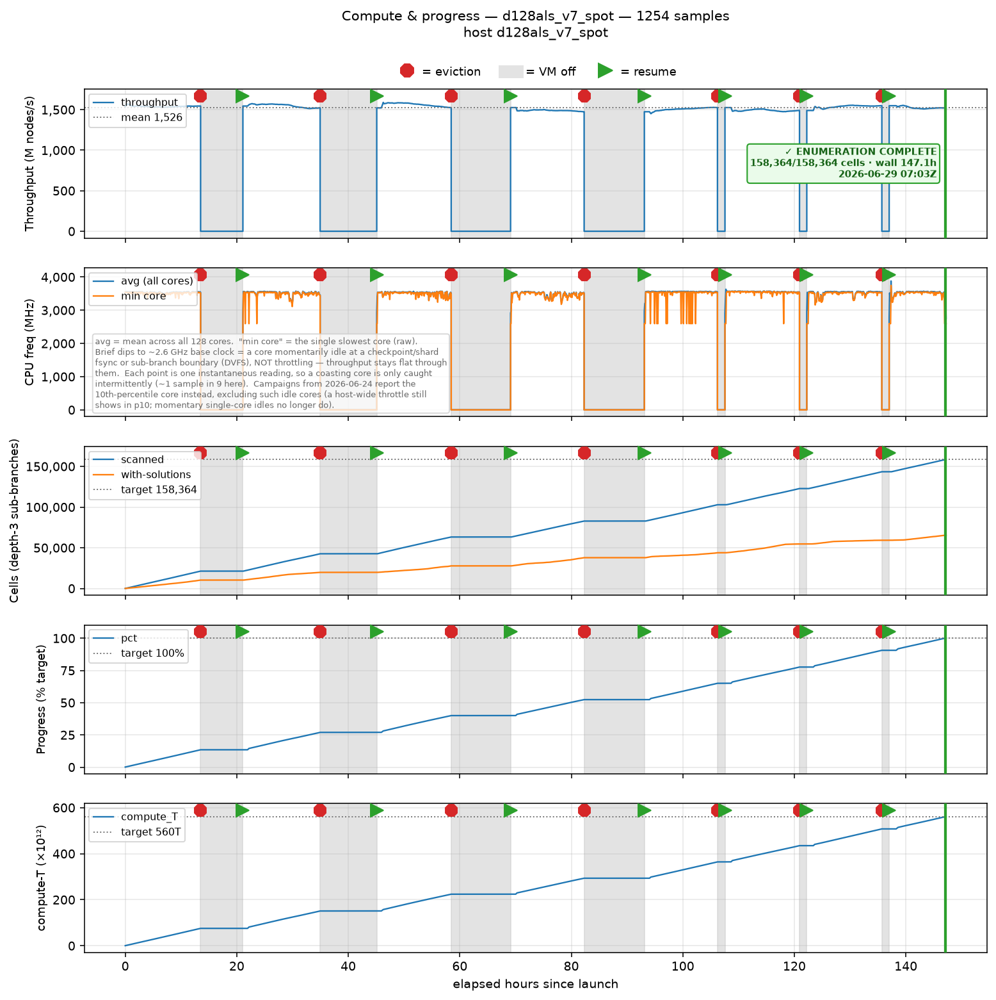
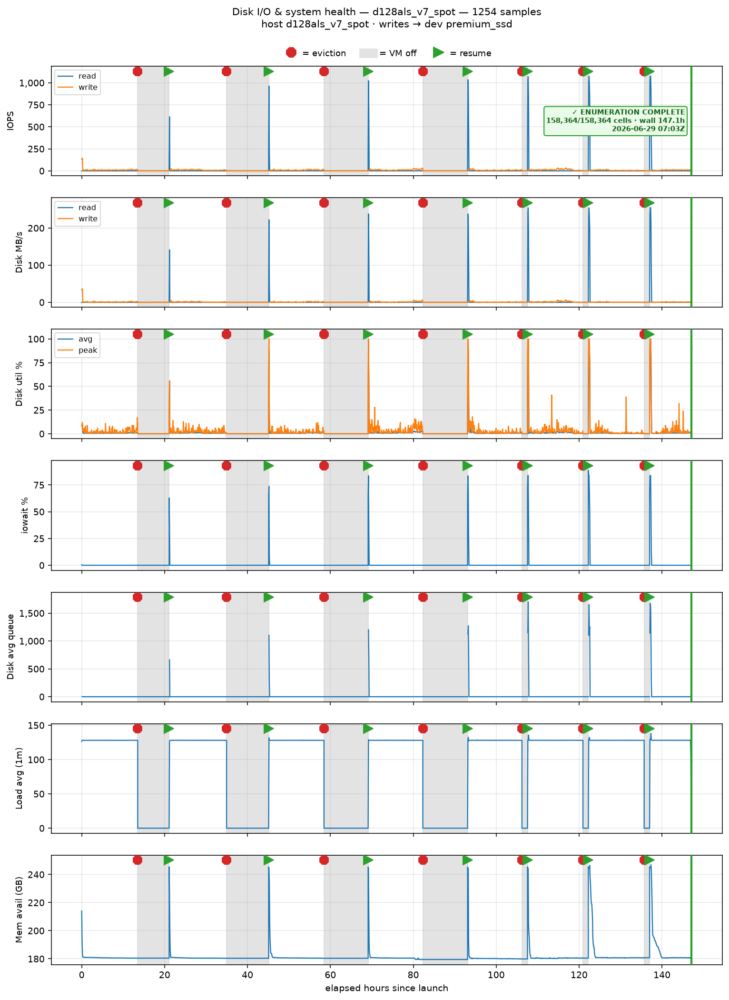
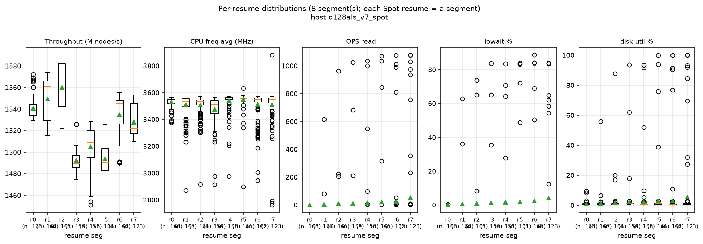
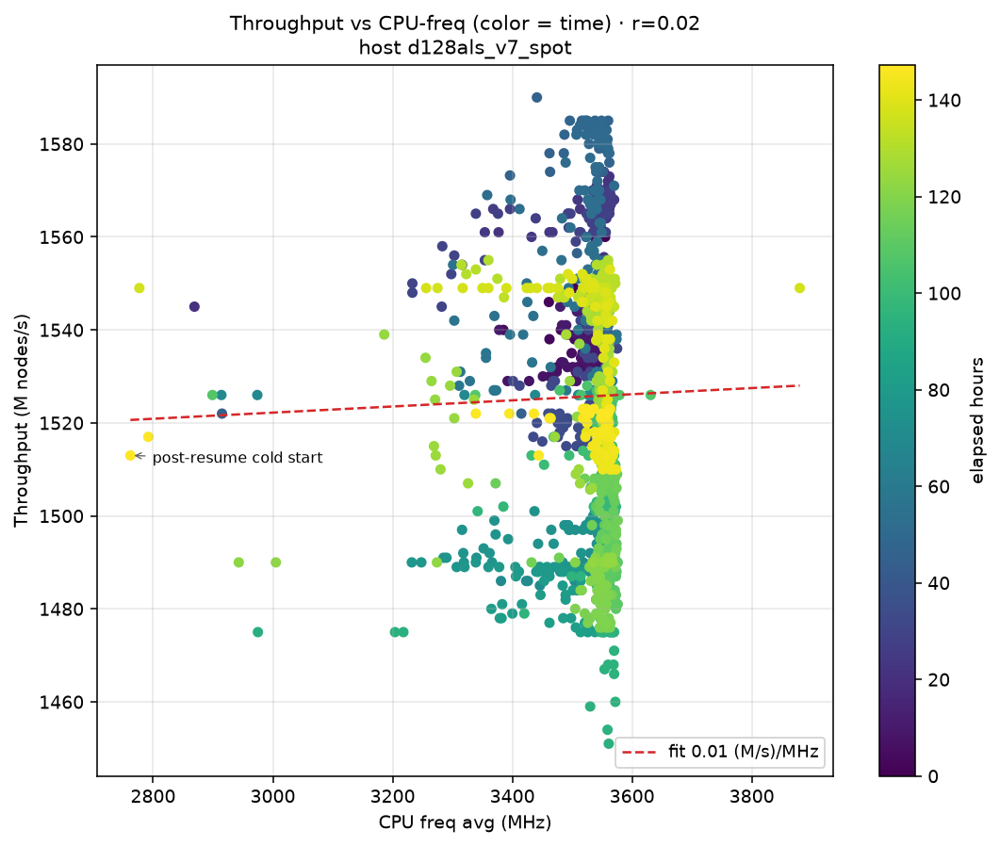
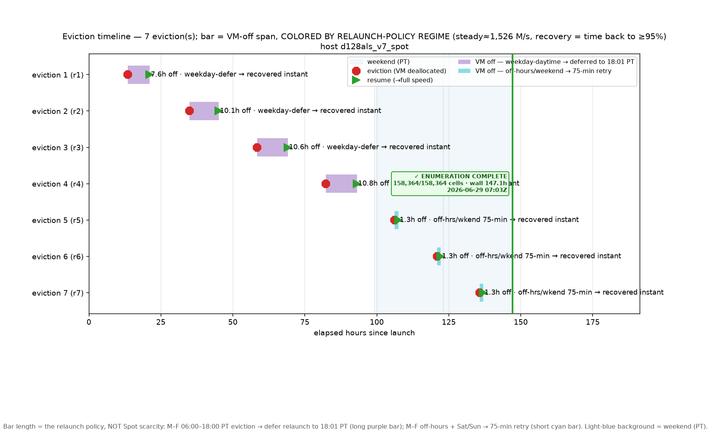
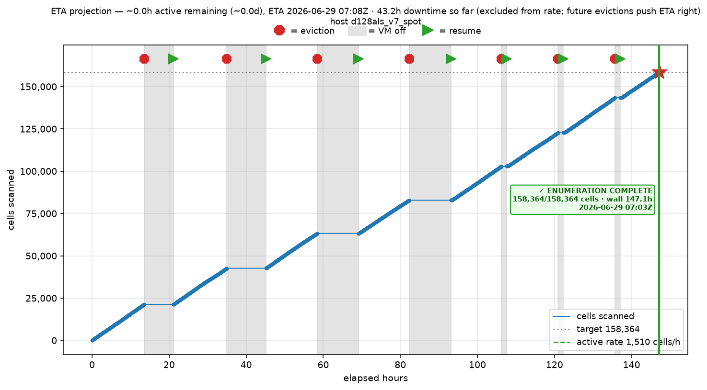

# Visualization — growth curve & campaign telemetry (how the space behaves and how the run executed)

This page collects the **non-PCA** graphs: the solution-count-vs-budget growth curve
(how the canonical set scales with enumeration depth) and, going forward, the campaign
telemetry plots (throughput, CPU frequency, eviction timeline, cells-scanned).

← Back to [README.md](README.md) (index) · See also [viz_pca.md](viz_pca.md) (the 4 PCA scatters)

## Growth-curve plot (`viz_growth_curve.png/.svg`)

A non-PCA plot: **canonical solution count vs per-cell enumeration node budget**, log-log,
across the three canonical depths (11.2T → 100T → 560T), with a power-law fit and the projected
1120T point (clearly marked **NOT measured**).

**What it shows:**

- Records grow **sublinearly** with budget: ×50 budget (11.2T→560T) yields only ×13.86 records
  (global power-law exponent α ≈ 0.67; recent-leg α ≈ 0.65). The three measured points
  (11.2T = 759,608,573; 100T = 3,432,399,298; 560T = 10,525,271,997) lie close to the fit line.
- The enumeration is **strictly nested** (11.2T ⊆ 100T ⊆ 560T, 0 monotonicity violations) and
  **deepening, not broadening** — growth is existing productive cells yielding more, not new cells
  opening. None of the sampled sub-branches are exhausted at 560T, so the curve is the growth of a
  fixed-budget *slice*, not an approach to a total. This reframes the 1120T extension as a
  **discriminating test of the growth asymptote**, not merely more data.

See [`../documentation/HISTORY.md`](../documentation/HISTORY.md) §"3-point per-cell scaling
trajectory" for the full analysis, and [`../documentation/CANONICAL_HASHES.md`](../documentation/CANONICAL_HASHES.md) §"d3 560T" for the canonical record.

## Campaign telemetry — 560T re-run (2026-06-22 → 06-29)

Sampled at a 5-minute cadence across the from-scratch 560T re-run (1,254 samples, **7 real Spot
evictions / 8 resume segments**). These are *how the run executed* — reproduced from the preserved
`telemetry.csv`. Grey bands mark VM-off (eviction) intervals; boot-id keys each resume segment.
Captions/axes carry **no cloud identifiers** — only physical quantities.

### Compute & progress

### Disk I/O & system health

### Per-resume distributions

### Throughput vs CPU-frequency

### Eviction-recovery timeline

### ETA projection

A rendered viewer with all six panels + captions is committed alongside as
[`index.html`](../runs/20260608_560T_9a968fa2/viz/index.html). Future canonical campaigns
(1120T onward) emit the same panels from launch.

## Regeneration

- **Growth curve:** produced by `viz/growth_curve.py` (the dedicated growth-curve generator;
  consolidating it into `visualize.py` as a `--growth` mode is a tracked follow-up, kept separate
  for now).
- **Campaign telemetry (when present):** `python3 viz/visualize.py --telemetry <telemetry.csv>`
  renders the `tc_*` time-course + whisker/ETA panels.

Figures live under `runs/<run-id>/viz/` and are never inlined into `viz/` itself.
See [README.md](README.md) for the full recipe.
