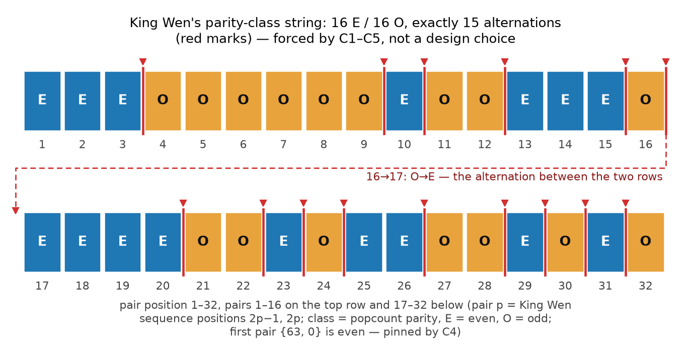

# Figure — TR-6, King Wen's parity-class string (`fig_tr6_parity_alternations`)

← [Visual capstone](README.md#structure-of-the-sequence) · Report: [TR-6 §Figure](../reports/TR6_PARITY_SKELETON.md#figure)

[](../reports/figures/fig_tr6_parity_alternations.svg)

*The figure as committed. Click the image for the SVG. The authoritative caption is in [TR-6 §Figure](../reports/TR6_PARITY_SKELETON.md#figure).*

## In plain terms

Every hexagram is "even" or "odd", depending on whether it has an even or odd number of solid lines,
and the two hexagrams of each pair always agree. This strip shows King Wen's 32 pairs in order, each
marked even or odd: there are exactly 16 of each, and the type switches exactly 15 times along the
sequence. TR-6 proves that every ordering obeying all five core rules has exactly those 15 switches,
so this count is forced by the rules and is not special to King Wen.

## What it shows

Two rows of 16 squares, one square per pair in sequence order (pair p holds King Wen positions 2p−1
and 2p). Blue squares marked E are even, orange squares marked O are odd; the letter carries the class,
so the strip reads without colour. A red mark sits at each boundary where the class changes. The
switch between pairs 16 and 17 falls at the row break, so it is drawn at the end of the top row with a
dashed connector, labelled 16→17: O→E, to the second row. The first pair, {63, 0}, is even, as C4
pins it.

## What it establishes, and what it does not

- **Establishes.** King Wen's parity-class string has a 16/16 split (Lemma 2) and exactly 15
  alternations, the theorem's forced value, which every C1–C5-valid ordering shares
  ([TR-6 §Figure](../reports/TR6_PARITY_SKELETON.md#figure)). Pairs are parity-homogeneous (Lemma 1),
  so the first member of each pair determines its class.
- **Does not establish.** Anything that distinguishes King Wen: because the count is forced, the 15
  alternations are true of every valid ordering. The picture shows where King Wen's alternations
  fall; the theorem is about how many there are.

## Provenance

- **Data.** No table. The class string is computed from `solve.py`'s King Wen sequence
  (`binary_hexagrams`): the popcount of each pair's first hexagram, mod 2. The generator asserts the
  16/16 split and the 15 alternations before drawing, and asserts that each cell letter meets 4.5:1
  contrast on its cell colour.
- **Generator.** `fig_tr6_parity_alternations()` in [`viz/report_figures.py`](report_figures.py).
- **Regenerate.** The whole set:

  ```bash
  cd reports/figures && python3 ../../viz/report_figures.py
  ```

  or this figure alone (the command TR-6's caption gives):

  ```bash
  cd reports/figures && python3 -c "import sys; sys.path.insert(0, '../../viz'); import report_figures as r; r.fig_tr6_parity_alternations()"
  ```

- **Toolchain.** matplotlib 3.11.0 and numpy 2.4.4. Under that pin the documented command reproduced
  the committed PNG byte for byte on 2026-09-29, with all twelve report figures (CX-233). See
  [Reproduce the figures](README.md#reproduce-the-figures).
- **Checks.** TR-6's [Verification Guide](../reports/TR6_PARITY_SKELETON.md#verification-guide).

## Review history

- **2026-09-25, Codex v3 review (V3B-09#11).** TR-6's caption gained the single-figure regeneration
  command.
- **2026-09-26, Codex figure review VIZ1, checked by Fable (F18).** As one 16-inch strip, the pair
  positions rendered at 5.9 px at a 900-px display. The strip became two rows of 16. CX-192.
- **2026-09-28, Codex visualization review, triaged by Fable.** The white O letters on orange measured
  2.16:1, and the 16→17 alternation at the row break had nothing after it. O is now near-black
  (8.76:1), and the dashed connector carries the alternation to the second row. CX-227 (TR-6
  revision row v1.11).
- **2026-09-29.** This page added, as part of the visual capstone (CX-233).

---

*Part of the [visual capstone](README.md), the companion to
[TR-12](../reports/TR12_QUERY_PROGRAM.md). A drawing of a string computed from the sequence; nothing
is claimed novel. Developed with AI assistance (Claude, Anthropic); corrections invited.*
